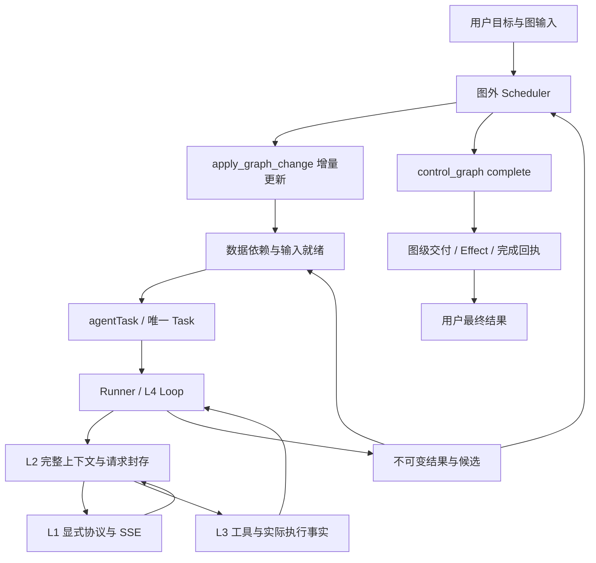

# AgentGo 系统架构

职责权威是 [五层规范](docs/design/five-layer-engineering-architecture.md)，当前 Graph 为 [agentTask 数据流图](docs/design/dataflow-graph-simplification-proposal.md)。

图没有 controller/router/tool/approval/acceptance/subgraph/join/wait_event/end。多输入是所有 agentTask 的共同就绪规则，迭代追加新实例。节点执行算法不由角色名称决定。

Candidate 保存任务实际代码状态，下游读取同一版本，后续修改形成新候选。Delivery 在图级完成时提交选定版本，不能把命令成功、模型自述或普通任务完成当成图成功。

Trace/UI 是横切面。模型文本来自 L2 WatchModelOutput，文件/命令/任务/交付保持独立事实；SWE Test Runner 由 Python 记录测试身份并判题。
