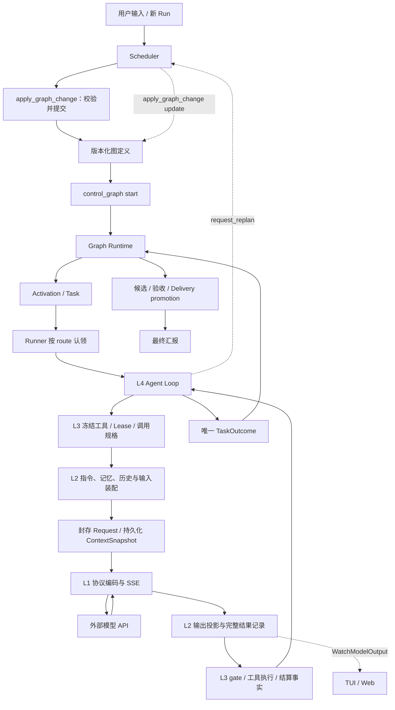

# AgentGo 系统架构

当前职责权威是 [五层工程规范](docs/design/five-layer-engineering-architecture.md)，工具与版本分别见 [工具契约](docs/design/tool-taxonomy-and-contracts.md) 和 [冻结基线](docs/design/contract-freeze-2026-08-30.md)。原多阶段工具设计已 [归档](docs/archived/architecture-before-four-categories.md)，不得由旧图示恢复退役控制机制。

## 组件与数据流

层号表示权责，执行不是从 L5 单向走到 L1 就结束。工具结果进入后续历史，TaskOutcome 驱动图的数据流；模型返回 chunk 只是一轮调用的输入输出事实。

## 图与执行

新图使用 graph/v5。模型通过同一个 apply_graph_change 创建或更改图，内部完成结构/能力/验收准入并原子提交；草案是内部事务状态。start/cancel 由 control_graph 显式发起。运行中更新采用 in_flight=preserve，当前执行保留冻结定义，未来 Activation 使用新版本。

Graph Runtime 按静态路由与输入端口发布 Task，Runner 按配置的 kind/event_type 认领。Controller 只做编排；普通执行 Agent 可申请重新规划，不能直接改变其它节点状态。图节点角色持久化后用于 Lease 授权，不能从自定义 route 猜权限。

单赋值端口与单 mutable producer 的 Delivery 基线仍有效。新接口不意味着支持任意 OR 汇合、暂停/恢复、跳过节点或多候选联合 promotion。失败/阻塞/取消与 success 分开；终态图不会被普通消息复活。

## L1/L2 与 Loop

L2 是上下文唯一装配者，收集角色、任务目标、记忆、历史、工具及 typed 输入。Raw History 保持不变；重复的同文件读取可引用化，不能把不同路径的相同内容误判成同一次读取。旧 Observation 控制历史模式已删除。

L1 接收完整封存请求，处理显式 Responses 或 Chat Completions SSE，归一化正文、reasoning、工具调用与 usage。EOF、半截 JSON、截断和 provider failure 不能视为成功。未完成参数不得执行工具。

L4 根据真实结果继续调用、处理错误/取消或完成唯一终态，不再按默认轮数、新知识数量、无进展/探索预算强制模型提交报告或转入恢复。用户显式限制、HTTP/进程超时和 provider 配额保留各自语义。finalizing 后只结算本轮事实，后续工具不执行。

## 工具与执行事实

核心目录为执行、编排、检视、通信四类共 13 项。文件写入统一 apply_change，命令统一 run_shell；独立 run_check、Observation、提交修改决策以及模型草案步骤已退役。

每次工具调用绑定 Run/Task/Attempt/Turn/Invocation/CallID。tool_call、实际 Registry 派发、Shell 进程启动、执行结果分别记录。超时和取消保留部分输出，不伪造退出码；外置结果写入失败会阻止后续工具。检视读取这些事实，不产生工作。

Effect Journal 在副作用前 prepared，结束后明确 settle；结果不确定记 unknown，恢复时不得静默重跑。候选工作区与 Delivery 保存实际文件版本、manifest 和产物引用；验收使用同一候选，promotion 前核对冻结内容。

## UI、消息与持久化

UI 使用 L2 WatchModelOutput 获取快照及增量；eventCursor 由 L2 管理，过期/慢订阅明确重同步。模型完整输出在运行时写盘，Hub 不承担完成轮次持久化。

send_message 只传递信息，返回投递回执，不唤醒、不打断、不创建 Activation。request_user_input 管理用户问答；用户未回答不等于批准。内部用户控制与 watchdog 运行保护是独立来源。

启动创建新 Session，当前快照版本 7；进入历史会话不自动续跑。新数据采用独立版本目录，旧记录保留且不转换为新请求。当前版本、拒绝规则与文件索引见 AGENTS.md。

## 外部测试

SWE Test Runner 是 Python 测试程序，不是 L3。它独立决定正式 pytest 范围、被测代码身份和 verdict；AgentGo 不解释 CheckContract 或 pytest 是否通过。离线单元测试、本地 SSE 二进制 fixture 和真实 SWE 是不同验证。当前真实 SWE 暂缓，实际证据见工具契约第 13 章。
