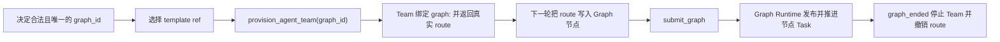

# AgentTemplate v1：按需组建 Agent Team

> 状态：已实现（2026-08，Graph-scoped Team 生命周期）
>
> AgentTemplate 是 Scheduler 在运行期间创建 Graph 节点执行 Agent 的能力模板。它解决“只配置 LLM 也能启动，任务变复杂后再组建团队”的问题；Team 是 Graph 的运行资源，不替代 Graph，也不把模板本身变成 Task。

## 1. 启动形态

AgentGo 支持两种等价的启动入口：

1. **Scheduler-only**：主配置只提供有效的 `llm:`。进程启动时没有常驻子 Agent，Scheduler 根据任务需要从 AgentTemplate 按需 provision 执行 Agent。
2. **预热 Team**：额外配置 `agents:`。这些 Agent 在启动时创建并长期监听其 `event_type`；Scheduler 仍可使用模板补充临时能力。

因此 `agents:` 是可选的容量和延迟优化，不再是启动前置条件。未配置静态 Agent 时，Scheduler 不能把 Graph 节点投递到一个想象出来的 kind 或 route；它必须先决定 Graph ID，以该 `graph_id` 从模板 provision 真实实例，下一轮读取真实 route 后再提交引用该 route 的 Graph。

最小配置：

```yaml
llm:
  base_url: https://api.openai.com/v1
  api_key: ${OPENAI_API_KEY}
  default_model: gpt-4o
```

## 2. 三个不同层次

| 概念 | 作用 | 是否执行工作 | 生命周期 |
|---|---|---:|---|
| `AgentTemplate` | 描述一种可实例化能力：工具、模型、提示词、能力标签和运行边界 | 否 | 配置/版本级，稳定且可复用 |
| `Team` | 为某个 Graph provision 的同质 Agent 实例集合及私有 route | 否 | 默认 Graph 级；`graph_ended` 后停止。仅 legacy provision 为 controller task 级 |
| `Task` | Graph activation 发布的可执行节点实例，路由到某个真实 Agent | 是 | 节点 activation 生命周期；回边重进会产生新 Task |

同一模板可以创建多个 Agent，同一 Agent 可以依次执行同一 Graph 的多个 Task。模板 ref 不是 `Task.ID`，模板也不携带 Graph 转移、节点角色或验收目标；这些由 Scheduler 提交的 GraphDocument 决定。

## 3. 模板来源与身份

v1 总是提供三个内置模板：

| ref | 预期用途 | 主要边界 |
|---|---|---|
| `builtin/generalist@1` | 通用实现与修复 | 可读写项目并运行命令 |
| `builtin/explorer@1` | 第一轮调查和只读分析 | 不写项目文件 |
| `builtin/verifier@1` | 正式验收 | 只读文件/网络闭集 + `submit_task_result`，不授予 Shell、消息、交互或重规划工具 |

外部模板通过主配置加载：

```yaml
agent_templates:
  user_dirs:
    - /Users/me/.config/agentgo/templates
  project_dirs:
    - agent-templates
  max_runtime_agents: 8
```

- `user_dirs` 中的模板获得 `user/` namespace，适合个人或组织复用；支持 `~/`，普通相对路径按启动工作目录解析。
- `project_dirs` 中的模板获得 `project/` namespace，普通相对路径按 `project_root` 解析；推荐目录是仓库根下的 `agent-templates/`。
- 不要把项目模板放进 `.agentgo/`；该目录用于运行状态并通常被 gitignore，不适合作为可评审的项目配置源。
- 不存在的目录按空目录处理，便于先配置后创建；目录只扫描当前层的 `.yaml` / `.yml` 文件，不递归读取子目录。
- namespace 由加载来源决定，模板文件不能自行伪造。
- 完整 ref 为 `<namespace>/<name>@<version>`；例如 `project/rust-migrator@1`。
- 模板加载后生成确定性的 SHA-256 digest。持久化 TeamSpec 同时记录 ref 与 digest，避免“同一个名字、实际内容已经变化”造成静默漂移。
- 内置模板不能被外部模板覆盖；同一 namespace 内重复的 `name@version` 会在启动期报错。不同 namespace 可以使用相同名字。

`max_runtime_agents` 是模板实例的全局运行期上限，省略或为零时使用 8，硬上限为 32；静态 `agents:` 的预热实例不占用该额度。具体模板还可以用 `limits.max_replicas` 限制单次 Team provision 的副本数。

## 4. 外部模板 YAML

v1 采用**一文件一个模板**，不使用顶层 `templates:` 数组，也不引用主配置中的 `tool_profiles`。示例 `agent-templates/rust-migrator.yaml`：

```yaml
name: rust-migrator
version: 1
description: 分阶段把 Go 组件迁移到 Rust，并保留可验证的兼容边界。
capabilities:
  - code_read
  - code_write
  - shell
tools:
  - read_file
  - list_dir
  - grep_search
  - glob_search
  - write_file
  - edit_file
  - run_shell
  - request_replan
model: gpt-4o
system_prompt_file: prompts/rust-migrator.md
limits:
  task_max_retries: 3
  max_replicas: 2
```

字段规则：

- `name`：必填；必须匹配 `^[a-z][a-z0-9_-]{0,63}$`，并和来源 namespace、`version` 共同组成 ref。
- `version`：必填正整数。行为发生不兼容变化时创建新版本，不要原地伪装成旧版本。
- `description`：必填；供 Scheduler 选择模板时理解用途和边界。
- `capabilities`：可选；是路由提示标签，不是授权。条目会 trim，但不能为空或重复。
- `tools`：必填、非空；每项必须是 AgentGo 已注册的真实工具名，trim 后不能为空或重复。真正权限只由该 allowlist 决定。
- `model`：可选；空时在加载期解析为 `llm.default_model`（或 Scheduler model）并进入 digest。因此存在 ready TeamSpec 时改变全局默认模型也属于能力定义漂移，需要按恢复规则处理。
- `system_prompt` / `system_prompt_file`：恰好填写一个。文件路径相对该来源的模板目录解析；解析后的 prompt 内容进入 digest，路径本身不进入。绝对路径、反斜杠、`..` 和符号链接越界都会被拒绝。
- `limits`：只保留 `task_max_retries`（默认 3）与 `max_replicas`（默认 4）。旧 `agent_max_loops` / `context_limit` / `enforce_compact_token_threshold` 都会返回迁移诊断；Context fitting 由 framework Context v3 Policy 统一拥有。

外部模板不能获得 Scheduler 独占的 Graph 控制工具。普通模板遇到需要改图的事实应调用 `request_replan`；用作 acceptance route 的验收模板还必须通过 Graph 提交时的只读闭集校验，只能通过 `submit_task_result.verdict`（以及适用的证据字段）提交节点结果，无法判断时提交 `status=blocked`，completed 结果省略 `event`。

v1 不实现模板继承、模板热编辑、远端模板仓库或 `TeamPreset`。修改或新建磁盘模板不会悄悄改变当前 Catalog 和已经运行的实例；需要下次启动重新加载，并以新 digest 生效。

## 5. Scheduler 的 Graph-first provision 流程

Scheduler 按以下顺序准备 Graph 执行资源：



“先确定 Graph 身份、再 provision、下一轮提交 Graph”是强约束：

- 根 Scheduler task 必须先决定一个合法且全局唯一的 `graph_id`，并显式传给 `provision_agent_team`。图内 controller 调用时可以省略以继承当前 Graph；显式值不得绑定另一个 Graph。
- provision 成功的返回条件是 Team 已 ready、私有 route 已注册，并已绑定 `graph:<graph_id>`。Scheduler 必须等下一轮看到真实 `event_type`，才能写入节点 `metadata.route`；同一响应中不能猜 route。
- `submit_graph` / `patch_graph` 会对产任务节点的 route owner scope 与 capability 做 fail-closed 校验。跨 Graph、legacy task-owned 或工具不足的 route 在提交/补丁阶段直接拒绝，不会等到 Watchdog 才发现无人认领。
- 同一 Graph 下相同 template ref、purpose 和副本数是幂等请求；已有 ready Team 会返回同一个 Team ID 与 route，不重复扩容，也不受发起 provision 的 controller activation 变化影响。
- Graph-owned Team 从 provision 成功起存活到 `graph_ended`。origin Scheduler task 先进入 completed/failed/blocked/cancelled 都不会回收它；Graph 终态才停止实例、撤销 route，并持久化停止原因。
- 如果 Graph 从未成功提交，而 origin controller 已终态，预绑定资源会以 `graph_binding_orphan` fail-closed 回收。省略 `graph_id` 只保留 legacy `publish_task` 的 controller-task-scoped 生命周期。
- 内联 subgraph 的运行时 `graph_id` 由父节点 activation 派生，不继承父 Graph 的私有 Team scope；内联子图只能使用全局静态 route。需要动态 Team 时，把节点留在父图，或拆成具有明确 `graph_id`、可先 provision 的独立 Graph。
- Team 私有 route 是 provision 产生的事实，不应预写进模板，也不能由 LLM 猜测；创建后会随 TeamSpec 稳定持久化以支持恢复。
- 一个 provisioned Agent 是有上限的节点执行资源，不是新的 Graph 控制者；它无权直接调整拓扑。

工具返回稳定的 snake_case JSON，其中 `graph_id` 是生命周期所有者，`tools` 是已运行实例的真实 allowlist，不是模板的语义标签：

```json
{"team_id":"...","event_type":"team:...","graph_id":"g-audit","template_ref":"builtin/generalist@1","template_digest":"sha256:...","agent_ids":["..."],"tools":["read_file","write_file"],"replicas":1,"reused":false}
```

对简单工作，Graph 可以只有一个 `generalist` 节点和 `end`；对大型迁移，可以 fan-out 多个调查/实现节点，经 `join` 汇合后再进入 controller 汇总或 acceptance。当前无 flow generation/correlation token：非 barrier 节点最多一条静态入边，join / acceptance 的每个 `target_input` 也只有一条生产边；并行 AND 使用不同端口，条件分支各自保留后续与 `end`，不做共享端口 OR 或普通节点汇流。join 成功事件固定为 `completed`。acceptance 必须有非空 title 与写明逐项验收标准的非空 description；completed 结果省略 `event`，业务结论只按 `$.verdict eq pass|fixable|failed` 路由，`failed` / `blocked` 事件仅用于 Runtime 兜底。证据或能力不足时 verifier 提交 `status=blocked`；`disputed` 是 Runtime 核验状态。

## 6. 正式验收

如果没有已运行且工具匹配的验收 route，Scheduler 使用当前 Graph 的 `graph_id` 和稳定 purpose `formal_acceptance` 从 `builtin/verifier@1` provision 单副本 runner。下一轮取得真实 route 后，把它写入 acceptance 节点的 `metadata.route`；同一 Graph 后续验收可幂等复用该 ready Team。

`builtin/verifier@1` 的工具面固定为 read/list/grep/glob/web + `submit_task_result` 的闭集，不授予文件写/编辑、`run_shell`、消息、发任务、用户交互或 `request_replan`。它通过只读文件/网络工具和 Graph 自动绑定的上游 Result/Evidence 做独立判断；当前闭集不包含 MCP，未来只有工具元数据能证明 read-only 后才扩展。需要 CLI/Shell 的检查必须由实现节点下游、无文件写工具的普通 checker agent 执行，并把结构化结果与证据经 `implement → checker → acceptance` 数据流传给 verifier；Graph 因果边证明检查晚于实现，Evidence 本身只证明调用事实，不证明节点内最后写入顺序。这是能力面的物理限制，但仍不等价于 OS 级沙箱。

项目可以提供更专业的 verifier 模板，但模板只能改变“由谁、用什么工具执行检查”，不能改变以下控制面事实：

- acceptance 是 Graph 的发任务型节点，非空 task title 标识验收对象，非空 task description 逐项写明判据；
- runner 必须通过 `submit_task_result` 提交 `verdict=pass|fixable|failed` 与适用证据；completed 结果省略 `event`，结果由 Graph Runtime 用于 `$.verdict eq ...` 边条件与节点终态；
- runner 无权修改 Graph 或自行宣布整个 Graph 完成；失败/可修复结论沿显式 verdict 边，无法判断则以 blocked 终态回到 Scheduler；
- acceptance Team 与其他动态 Team 一样归当前 Graph；`graph_ended` 统一撤销其 route，不存在独立的 Plan/AcceptanceRun Team 生命周期。

## 7. 持久化与恢复

模板创建的 Team 以 `TeamSpec` 持久化 `template_ref`、`template_digest`、`controller_task_id`（来源审计）、`graph_id`（非空时为生命周期所有者）、用途、副本数和稳定私有 route。通过该 route 发布的节点 Task 仍由 GraphStore/TaskStore 各自恢复。恢复时：

- 有活动 session：`<session-dir>/agent-teams.json`；
- 无 session 管理器：`<project-root>/.agentgo/state/agent-teams.json`。

1. 用 ref 在当前 Catalog 中定位模板；
2. 核对 digest 与 TeamSpec 记录一致；
3. 对 Graph-owned Team 查询 GraphStore：Graph 存在且非终态时，用原 TeamSpec 的稳定 route 恢复实例；Graph 已终态时标记 `graph_terminal:<status>` 并跳过；
4. Graph 暂不存在但 origin controller 仍活跃时保留并恢复（覆盖 provision 成功、submit_graph 尚未落盘的崩溃窗口）；Graph 不存在且 origin 已终态/消失时标记 `graph_binding_orphan`；
5. ref 缺失、digest 不同或恢复所需总副本超过容量时，不使用“差不多”的模板顶替；Team Manager 以 fail-closed 方式拒绝启动任何模板 runner/route。用户需要恢复原模板或显式处理持久 TeamSpec 后再启动，AgentTemplate v1 不会把模板引用自动迁移到新版本。

已经进入终态的 Graph 所属 TeamSpec 会标记为 stopped，不参与 live Team 的 digest/容量恢复；运行中 Graph 的 ready Team 必须全部通过校验后才统一安装 route，避免只恢复半支团队。legacy task-owned Team 继续按 controller task 是否终态恢复或停止。

旧版 `agent-teams.json` 的 schema v1 尚无 `graph_id`。升级时 `OpenStore` 只读加载并冻结所有 mutation，待 GraphStore 完成 durable recovery 后再按每个 ready Team 的精确 `event_type` 对账当前节点定义与 activation 冻结定义：唯一 Graph 引用原子升级为 Graph-owned，零引用保留 legacy task-owned，多 Graph 引用则整次启动 fail-closed 且磁盘继续保持 v1。终态 Graph 也算权威引用，绑定后按 `graph_terminal:<status>` 停止，避免错误恢复成 live legacy route。

这种恢复语义保存的是“当时确认的能力定义”，而不是进程内 goroutine。Team ID、私有 route、Graph ID、模板 ref 与 digest 是持久身份；Agent instance ID 可由 TeamSpec 确定性重建，无需单独保存。

## 8. v1 验收边界

实现至少应证明：

1. 只有有效 `llm:` 时可以 Scheduler-only 启动，快照中不会出现伪造的 worker capability。
2. 原有 `agents:` 配置继续创建预热 Agent，行为向后兼容。
3. 三个内置模板始终可列出，外部 user/project 模板按 namespace 和版本校验。
4. Scheduler 先决定 graph_id，带同一 graph_id provision；route ready 后下一轮提交引用该 route 的 Graph。
5. 全局和 per-template 容量边界生效。
6. `builtin/verifier@1` 可以承接 Graph acceptance 节点，且不获得 Graph 修改权限。
7. origin Scheduler task 终态不回收 Graph Team；graph_ended 才停止实例并撤销 route。未提交 Graph 的预绑定 orphan 会 fail-closed 回收。
8. submit_graph / patch_graph 会拒绝跨 Graph、legacy task-owned 或 capability 不足的私有 route。
9. TeamSpec 的 ref+digest、Graph ID 与稳定 route 可持久化；恢复时内容漂移会使模板 Team 恢复整体 fail-closed，不会静默运行新内容。
10. 普通 Reactor 和普通 Agent 仍不能借模板绕开 Scheduler 修改 Graph。

相关文档：

- [DynamicDAG.md](../archived/DynamicDAG.md) — V6 前 Plan 时代历史文档（图、唤醒、验收和恢复的不变量）
- [yaml-config-guide.md](../yaml-config-guide.md) — 主配置与外部模板 schema
- [tool-profiles.md](../tool-profiles.md) — 工具授权和模板能力边界
