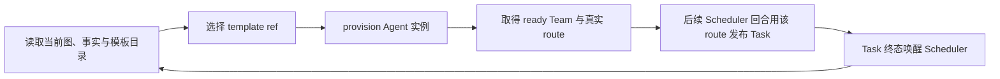

# AgentTemplate v1：按需组建 Agent Team

> 状态：已实现（2026-07）
>
> AgentTemplate 是 Scheduler 在运行期间创建执行 Agent 的能力模板。它解决“只配置 LLM 也能启动，任务变复杂后再组建团队”的问题；不替代动态 DAG，也不把模板本身变成 Task。

## 1. 启动形态

AgentGo 支持两种等价的启动入口：

1. **Scheduler-only**：主配置只提供有效的 `llm:`。进程启动时没有常驻子 Agent，Scheduler 根据任务需要从 AgentTemplate 按需 provision 执行 Agent。
2. **预热 Team**：额外配置 `agents:`。这些 Agent 在启动时创建并长期监听其 `event_type`；Scheduler 仍可使用模板补充临时能力。

因此 `agents:` 是可选的容量和延迟优化，不再是启动前置条件。未配置静态 Agent 时，Scheduler 不能把 Task 投递到一个想象出来的 kind 或 route；它必须先从模板 provision 真实的运行实例，拿到该实例的真实 route，再发布下一轮 Task。

最小配置：

```yaml
llm:
  base_url: https://api.openai.com/v1
  api_key: ${OPENAI_API_KEY}
  default_model: gpt-4o
```

## 2. 三个不同层次

| 概念 | 作用 | 是否执行工作 | 生命周期 |
|---|---|---:|---|
| `AgentTemplate` | 描述一种可实例化能力：工具、模型、提示词、能力标签和运行边界 | 否 | 配置/版本级，稳定且可复用 |
| `Team` | 当前 Plan 已 provision 的同质 Agent 实例集合及私有 route | 否 | Plan 级；TeamSpec 持久化，v1 不提供 TeamPreset |
| `Task` | DAG 中一个可验收的执行节点，路由到某个真实 Agent 实例 | 是 | Plan/Task 生命周期；一个执行节点对应一个 Task |

同一模板可以创建多个 Agent，同一 Agent 可以依次执行多个 Task。模板 ref 不是 `Task.ID`，模板也不携带 DAG 依赖、节点角色或验收目标；这些仍由 Scheduler 在发布 Task 时决定。

## 3. 模板来源与身份

v1 总是提供三个内置模板：

| ref | 预期用途 | 主要边界 |
|---|---|---|
| `builtin/generalist@1` | 通用实现与修复 | 可读写项目并运行命令 |
| `builtin/explorer@1` | 第一轮调查和只读分析 | 不写项目文件 |
| `builtin/verifier@1` | 正式验收 | 不授予 `write_file`/`edit_file`，执行检查并提交结构化结果 |

外部模板通过主配置加载：

```yaml
agent_templates:
  user_dirs:
    - /Users/me/.config/agentgo/templates
  project_dirs:
    - agent-templates
  max_runtime_agents: 8
```

- `user_dirs` 中的模板获得 `user/` namespace，适合个人或组织复用；支持 `~/`，普通相对路径按启动工作目录解析。
- `project_dirs` 中的模板获得 `project/` namespace，普通相对路径按 `project_root` 解析；推荐目录是仓库根下的 `agent-templates/`。
- 不要把项目模板放进 `.agentgo/`；该目录用于运行状态并通常被 gitignore，不适合作为可评审的项目配置源。
- 不存在的目录按空目录处理，便于先配置后创建；目录只扫描当前层的 `.yaml` / `.yml` 文件，不递归读取子目录。
- namespace 由加载来源决定，模板文件不能自行伪造。
- 完整 ref 为 `<namespace>/<name>@<version>`；例如 `project/rust-migrator@1`。
- 模板加载后生成确定性的 SHA-256 digest。持久化 TeamSpec 同时记录 ref 与 digest，避免“同一个名字、实际内容已经变化”造成静默漂移。
- 内置模板不能被外部模板覆盖；同一 namespace 内重复的 `name@version` 会在启动期报错。不同 namespace 可以使用相同名字。

`max_runtime_agents` 是模板实例的全局运行期上限，省略或为零时使用 8，硬上限为 32；静态 `agents:` 的预热实例不占用该额度。具体模板还可以用 `limits.max_replicas` 限制单次 Team provision 的副本数。

## 4. 外部模板 YAML

v1 采用**一文件一个模板**，不使用顶层 `templates:` 数组，也不引用主配置中的 `tool_profiles`。示例 `agent-templates/rust-migrator.yaml`：

```yaml
name: rust-migrator
version: 1
description: 分阶段把 Go 组件迁移到 Rust，并保留可验证的兼容边界。
capabilities:
  - code_read
  - code_write
  - shell
tools:
  - read_file
  - list_dir
  - grep_search
  - glob_search
  - write_file
  - edit_file
  - run_shell
  - request_replan
model: gpt-4o
system_prompt_file: prompts/rust-migrator.md
limits:
  agent_max_loops: 12
  task_max_retries: 3
  enforce_compact_token_threshold: 4000
  context_limit: 20000
  max_replicas: 2
```

字段规则：

- `name`：必填；必须匹配 `^[a-z][a-z0-9_-]{0,63}$`，并和来源 namespace、`version` 共同组成 ref。
- `version`：必填正整数。行为发生不兼容变化时创建新版本，不要原地伪装成旧版本。
- `description`：必填；供 Scheduler 选择模板时理解用途和边界。
- `capabilities`：可选；是路由提示标签，不是授权。条目会 trim，但不能为空或重复。
- `tools`：必填、非空；每项必须是 AgentGo 已注册的真实工具名，trim 后不能为空或重复。真正权限只由该 allowlist 决定。
- `model`：可选；空时在加载期解析为 `llm.default_model`（或 Scheduler model）并进入 digest。因此存在 ready TeamSpec 时改变全局默认模型也属于能力定义漂移，需要按恢复规则处理。
- `system_prompt` / `system_prompt_file`：恰好填写一个。文件路径相对该来源的模板目录解析；解析后的 prompt 内容进入 digest，路径本身不进入。绝对路径、反斜杠、`..` 和符号链接越界都会被拒绝。
- `limits`：可选；默认值依次为 `agent_max_loops: 10`、`task_max_retries: 3`、`enforce_compact_token_threshold: 4000`、`context_limit: 16000`、`max_replicas: 4`。显式值必须为正数，其中 `max_replicas` 限制单个 Team 请求的副本数。

外部模板不能获得 Scheduler 独占的 DAG 控制工具。`submit_acceptance_result` 只适合专门的 verifier 模板；普通模板遇到需要改图的事实应调用 `request_replan`。

v1 不实现模板继承、模板热编辑、远端模板仓库或 `TeamPreset`。修改或新建磁盘模板不会悄悄改变当前 Catalog 和已经运行的实例；需要下次启动重新加载，并以新 digest 生效。

## 5. Scheduler 的 provision 流程

Scheduler 按以下顺序扩展 DAG：



“先 provision、再 publish”是强约束：

- provision 成功的返回条件是 Team 已 ready、route 已注册；Scheduler 随后才能调用 `publish_task`。provision 失败发生在 Task 发布之前，因此不会留下一个永远无人认领的 pending Task。
- `provision_agent_team` 由当前 active controller 调用，参数只包含 template ref、清晰的 purpose 和副本数；Plan/controller 身份由控制面注入并校验，不能由普通 Agent 伪造。
- 同一 Plan 下相同 template ref、purpose 和副本数是幂等请求；已有 ready Team 会返回同一个 Team ID 与 route，不重复扩容。
- Task 仍由 `PlanMutationSource=scheduler` 注册进最新 DAG，并携带 `node_role`、依赖和预期产物。
- Team 私有 route 是 provision 产生的事实，不应预写进模板，也不能由 LLM 猜测；创建后会随 TeamSpec 稳定持久化以支持恢复。
- 一个 provisioned Agent 是有上限的运行资源，不是新的图控制者；它无权直接调整拓扑。

工具返回稳定的 snake_case JSON，其中 `tools` 是已运行实例的真实 allowlist，不是模板的语义标签：

```json
{"team_id":"...","event_type":"team:...","template_ref":"builtin/generalist@1","template_digest":"sha256:...","agent_ids":["..."],"tools":["read_file","write_file"],"replicas":1,"reused":false}
```

对简单任务，Scheduler 可以只创建一个 `generalist` Task；对大型迁移，可以先用 `explorer` 调查，再按独立产物/依赖拆分多个 implementation Task，最后 provision `verifier` 做正式验收。复杂度决定 DAG 形状，而不是决定是否必须预先写一份 Team YAML。

## 6. 正式验收

如果没有已运行且工具匹配的验收 route，Scheduler 使用稳定 purpose `formal_acceptance` 从 `builtin/verifier@1` provision 单副本 runner。它获得真实 route 后再创建与 `AcceptanceRun` 绑定的 acceptance Task；后续验收优先复用该 ready Team。

`builtin/verifier@1` 不授予 AgentGo 的文件写/编辑工具，但 `run_shell` 不是只读沙箱；“不修改被验收对象”仍由 prompt 约束和命令审批边界保障，不应解读为 OS 级强隔离。控制面会硬校验 `submit_acceptance_result`，并为 `command_exit` / `file_hash` 分别推导 `run_shell` / `read_file`；`evidence` / `manual` 等无法从 schema 确定推导的工具仍由 Scheduler 根据标准语义选型。

项目可以提供更专业的 verifier 模板，但模板只能改变“由谁、用什么工具执行检查”，不能改变以下控制面事实：

- AcceptanceSpec 仍针对最新 Plan revision、graph digest 和 spec revision；
- runner 必须通过 `submit_acceptance_result` 提交逐 Criterion 结果与真实 Evidence；
- 内置硬标准优先，runner 无权修改 DAG 或自行 finalize Plan；
- 正式验收结果事件仍统一为 `acceptance_completed`；Plan 在 finalize 或用户终止后另发 `plan_terminal` 供 Team 立即撤路由。两者都与 AgentTemplate、Agent kind 或 route 无关。

## 7. 持久化与恢复

模板创建的 Team 以 `TeamSpec` 持久化 `template_ref`、`template_digest`、Plan、用途、副本数和稳定私有 route；通过该 route 发布的 Task 仍按现有 Task/Plan 快照恢复。恢复时：

- 有活动 session：`<session-dir>/agent-teams.json`；
- 无 session 管理器：`<project-root>/.agentgo/state/agent-teams.json`。

1. 用 ref 在当前 Catalog 中定位模板；
2. 核对 digest 与 TeamSpec 记录一致；
3. 匹配后用原 TeamSpec 的稳定 route 重新 provision 运行实例，使恢复的 pending Task 仍有相同消费者；
4. ref 缺失、digest 不同或恢复所需总副本超过容量时，不使用“差不多”的模板顶替；Team Manager 以 fail-closed 方式拒绝启动任何模板 runner/route。用户需要恢复原模板或显式处理持久 TeamSpec 后再启动，v1 不自动迁移到新版本。

已经进入终态的 Plan 会先把所属 TeamSpec 标记为 stopped，不参与 live Team 的 digest/容量恢复；运行中 Plan 的 ready Team 必须全部通过校验后才统一安装 route，避免只恢复半支团队。

这种恢复语义保存的是“当时批准的能力定义”，而不是进程内 goroutine。Team ID、私有 route、Plan、模板 ref 与 digest 是持久身份；Agent instance ID 可由 TeamSpec 确定性重建，无需单独保存。

## 8. v1 验收边界

实现至少应证明：

1. 只有有效 `llm:` 时可以 Scheduler-only 启动，快照中不会出现伪造的 worker capability。
2. 原有 `agents:` 配置继续创建预热 Agent，行为向后兼容。
3. 三个内置模板始终可列出，外部 user/project 模板按 namespace 和版本校验。
4. Scheduler provision 成功、route ready 后才另行发布 Task；失败不会遗留孤儿 Task。
5. 全局和 per-template 容量边界生效。
6. `builtin/verifier@1` 可以承接正式 AcceptanceRun，且不获得图修改权限。
7. TeamSpec 的 ref+digest 与稳定 route 可持久化；恢复时内容漂移会使模板 Team 恢复整体 fail-closed，不会静默运行新内容。
8. 普通 Reactor 和普通 Agent 仍不能借模板绕开 Scheduler 修改计划内 DAG。

相关文档：

- [DynamicDAG.md](DynamicDAG.md) — 图、唤醒、验收和恢复的不变量
- [yaml-config-guide.md](../yaml-config-guide.md) — 主配置与外部模板 schema
- [tool-profiles.md](../tool-profiles.md) — 工具授权和模板能力边界
