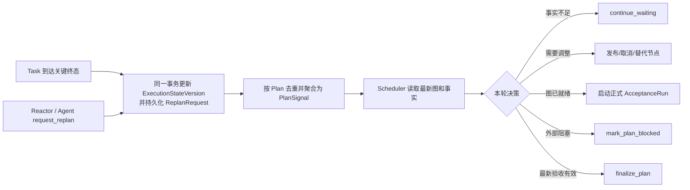

# Dynamic DAG：Scheduler + Reactor 动态任务图

> 状态：已实现（2026-07）
>
> 本文是动态 DAG 控制面的仓库内规范。思维导图用于设计讨论，本文与实际代码共同作为实现、测试和后续升级的依据。

## 1. 目标与边界

动态 DAG 用于处理不能在启动时一次规划完的任务：Scheduler 根据第一轮调查建立图，在执行事实持续到达时调整图，直到最新有效图通过正式验收。

系统遵守以下边界：

- 一个执行节点对应一个 `Task`，节点 ID 就是 `Task.ID`。
- `Plan` 是一张持续演化的图；`PlanID` 是跨版本稳定身份。首次创建时通常等于根 Scheduler Task 的 ID。
- 根 Scheduler Task 和恢复时创建的新 Scheduler Task 是控制节点，不是业务执行节点。
- `Plan.ActiveDecisionTaskID` 是当前唯一有权决策的 controller 身份；旧 controller 即使仍保留 Task 记录，也不能再次认领或修改图。
- `Task.EventType` / Agent kind 只负责执行路由，不决定节点能否唤醒 Scheduler，也不拥有图修改权限。
- Scheduler 是计划内拓扑的唯一决策者；Acceptance 控制路径只负责创建正式验收节点。
- Reactor 只能提交重新规划请求，不能直接修改计划内 DAG。
- Plan 只有在最新图、最新验收规范上取得有效的正式结果后才能结束。

主要实现位置：

- `internal/model/plan.go`：Plan、节点、版本、验收、预算模型
- `internal/plan/`：持久化 Store、Coordinator、图校验、验收和预算策略
- `internal/bootstrap/plan_runtime.go`：TaskStore 与 Plan 控制面的事实桥接
- `internal/scheduler/`：PlanSignal 等待、快照注入和决策确认
- `internal/tools/plan_control.go`：受控的 Scheduler / acceptance 工具面

## 2. 图模型

### 2.1 节点和角色

`CurrentNodeIDs` 定义当前版本真正有效的图。每个 ID 都对应 `Nodes` 中的一个 `PlanNode` 和 TaskStore 中的一个 `Task`。

| 角色 | 含义 |
|---|---|
| `controller` | Scheduler 控制 Task；关联 Plan，但不作为业务图节点 |
| `investigation` | 第一轮调查、事实收集、方案确认 |
| `implementation` | 实施、修复、迁移等交付工作 |
| `verification` | 非正式检查或辅助验证 |
| `acceptance` | 与 `AcceptanceRun` 绑定的正式验收 Task |

在验收规范尚未定义时，Scheduler 发布的普通节点默认归为 `investigation`；规范定义后默认归为 `implementation`。Scheduler 也可在 `publish_task` 中显式提供 `node_role`。

### 2.2 两类边

- `Dependencies` 是阻塞边：依赖 Task 必须 `completed`，下游才可执行。当前图会校验依赖存在且无环。
- `Supersedes` 是非阻塞的语义边：表示新节点替代了哪些旧节点，不参与执行解锁。

修复失败节点时，不应让替代任务依赖已经失败的节点。正确做法是先发布替代 Task，再通过 `supersede_tasks` 退休旧节点并记录替代关系。

### 2.3 当前图与历史

节点被替代后会从 `CurrentNodeIDs` 移出，但仍在 `Nodes` 中保留压缩记录：身份、短标题、终态、最多 600 字摘要以及创建/退休版本；Dependencies、Supersedes、失败指纹、产物引用和 trace 引用会从 Plan 热状态中移除。Scheduler 默认上下文只注入当前图、控制节点以及最近 8 个退休节点；更早的冷历史通过 `get_retired_node` 按需读取。完整 Task 受 TaskStore retention 策略管理；需要长期保留的审计事实应进入 trace、产物或专用持久存储，而不是依赖退休节点摘要。

这里区分“上下文压缩”和“可靠存储”：旧 Task 可以继续保留在会话快照中，以维持依赖闭包和审计，但不会全部塞进每轮 Scheduler 上下文。

## 3. 图身份和版本

三个版本号不能混为一个 `StateVersion`：

| 字段 | 何时变化 | 不会因为什么变化 |
|---|---|---|
| `CurrentRevision` / `PlanRevision` | 新增节点、退休/替代节点等图结构或规划语义变化 | Task 开始、完成、失败等运行事实 |
| `ExecutionStateVersion` | Task 状态/摘要/产物变化、ReplanRequest、验收结果、预算与进展事实变化 | 只读查询 |
| `CurrentAcceptanceSpecRevision` | 正式验收标准新增或增强 | 图形变化、Task 状态变化 |

`HandledStateVersion` 是 Scheduler 已处理到的执行事实水位。Scheduler 只能在一次决策成功后确认它观察到的版本；决策期间新到达的更高版本请求会继续保留。

`CurrentGraphDigest` 是当前有效图的确定性 SHA-256 摘要，输入包含当前节点的 ID、标题、角色、Dependencies 和 Supersedes。运行状态、证据和已退休节点不进入摘要。因此：

- `PlanRevision + GraphDigest` 共同标识待验收图；
- 相同图在不同运行状态下 digest 不变；
- 图一旦发生语义变化，旧 AcceptanceRun 自动失效。

所有图更新采用观察版本的乐观并发校验；过期的 `ObservedRevision` 会得到 revision conflict，调用方必须读取最新 Plan 后重新决策。Scheduler 发起的图、验收规范和终态变更还会在同一个 PlanStore 原子事务内核对 `ActiveDecisionTaskID`；外层 guard 通过后才被替换的旧 controller 会得到 controller authority conflict，不能利用 check-then-act 窗口落盘。

## 4. 逐 Task 终态唤醒与 Plan 级聚合

计划内 Task 的状态事实由 TaskStore 提交给 PlanCoordinator。任一节点进入 `completed`、`failed`、`cancelled` 或 `blocked`，都会创建持久化 `ReplanRequest` 并唤醒该 Plan 的 Scheduler；不需要等待同批其他 Task 全部结束。

这就是“逐节点唤醒”的含义：唤醒粒度是 Task 终态，消费粒度是 Plan。



除 Task 终态外，下列控制面事实也可以产生请求：

- Reactor 或 Agent 显式调用 `request_replan`；
- 正式验收完成或被判定 stale；
- 预算达到软警告或硬边界；
- 连续无进展；
- 用户解除暂停。

Task 终态、正式验收、预算、无进展和暂停恢复属于内置触发器，保证基本收敛和安全不变量；项目特有的“需要重规划”条件由 Reactor/Agent 调 `request_replan` 扩展，不需要新增 AgentType。

同一 Plan 的 pending 请求按稳定事件幂等键去重，并在 Scheduler 醒来时聚合为一个 `PlanSignal`，包含 request IDs、来源 Task IDs、原因集合、最高 urgency 和最新 `ExecutionStateVersion`。不同 Plan 的信号互不混合。单 Plan 最多保留 256 条 pending 请求；达到边界后，更多独立事件折叠为一个 `replan_overflow` 标记，避免事件风暴让持久状态无界增长。

被唤醒不等于必须改图。Scheduler 可以选择：

- `continue_waiting`：确认当前事实不足，继续等下一次关键事件；
- `publish_task` / `cancel_task` / `supersede_tasks`：发布、取消或替代节点；
- `ensure_acceptance_run`：创建正式验收；
- `mark_plan_blocked`：挂起等待外部条件或用户；
- `finalize_plan`：依据最新正式验收进入终态。

## 5. Scheduler 与 Reactor 的权限边界

### 5.1 Scheduler

Scheduler 通过内置工具修改 DAG。计划内 Task 发布前会校验内部的 `PlanMutationSource`，只有 Scheduler 或 Acceptance 控制路径能够注册新图节点。该字段不暴露为普通 LLM/YAML 参数。

Scheduler 快照包含当前 Plan 的 active controller 身份、版本、digest、预算、pending request 总数与有界摘要、当前节点语义、当前 Acceptance Criteria、仅匹配当前 revision/digest/spec 的最新 Acceptance 摘要、最近 8 条警告和压缩历史；因此新 controller 在恢复后不依赖旧 LLM 对话也能继续决策。每条 pending request 摘要保留 request ID、reason/detail、来源 Task/event、观察到的 revision/state version 和 urgency；快照按 high urgency、较新 state 优先，仅注入最多 16 条，单 detail 最多 480 字符、全部 detail 合计最多 4096 字符，并显式报告 omitted 数量，避免事件风暴占满 prompt。Acceptance 摘要包含 Run/Result ID、状态、verdict/reason、逐 Criterion 结果、失败指纹、残余风险和建议动作，但不默认注入可能很重的 Evidence；需要时以 Result ID 调 `get_acceptance_evidence`。旧图或 stale 结果不会出现在该 current 摘要中。所有拓扑与状态控制工具都会再次核对调用 Task 是否等于持久化的 `ActiveDecisionTaskID`。Plan 一旦有业务节点，或 controller 已成功调用 `write_file`、`edit_file`、`run_shell` 跨过只读边界，自然语言“完成”和 `report_done` 都不能绕过正式终态。尚未进入执行的空 Plan 仍兼容闲聊、状态查询和只读回答，并在回答结束时自动进入 `completed_no_execution`，不会留下无人消费的 running Plan。Plan 正式结束后，controller 只获得一个不暴露工具的最终汇报回合，不能在终态后继续产生副作用。

### 5.2 Reactor

用户 Reactor 新增动作：

```yaml
request_replan:
  reason_code: worker_retry_pressure
  urgency: high                   # normal / high
  detail: "Repeated retries suggest this node may need replacement."
```

YAML 只能提供字面量 `reason_code`、`urgency` 和可选 `detail`，不对它们做事件模板渲染。`PlanID`、PlanRevision、ExecutionStateVersion、来源 Task 和幂等键均从完整原始 trace 事件与 PlanStore 注入，不能由 YAML 伪造。

兼容边界如下：

- 来源 Task 未纳入 Plan 时，旧 `publish_task` Reactor 仍可直接发布兼容任务；
- 来源 Task 已属于 Plan 时，`publish_task` 意图会转换为 `request_replan`，由 Scheduler 决定是否以及如何改图；
- 计划内来源的 `spawn_agent` 和 isolated `invoke_llm` 同样转换为 `request_replan`，避免绕开图权限或产生未计入 PlanBudget 的 LLM 消耗；
- 自定义 `emit_trace` 必须使用 `user.<name>` 命名空间，不能伪造 `task_completed`、`acceptance_completed` 等系统事实事件。

唤醒权限依据 `PlanID + Task 事实`，与产生事实的 Agent kind / `EventType` 无关。

## 6. 正式验收

### 6.1 AcceptanceSpec 何时建立

推荐生命周期是：

1. Scheduler 发布 `investigation` 节点完成第一轮调查；
2. 调查事实足够后，调用 `define_acceptance_spec` 冻结 AcceptanceSpec v1；
3. 再发布 `implementation` 节点；
4. 图达到可验收状态时调用 `ensure_acceptance_run`。

持久化后的 Criterion 可以来自 `user`、`project`、`scheduler` 或 `builtin`，并声明范围、检查方式、目标和期望结果；但 `define_acceptance_spec` 的调用方只能提交前三类，并且必须省略 `builtin.current_graph_completed`、`source=builtin` 和 `BuiltinHardRule`。控制面会在每次定义规范时自行注入受保护的 `builtin.current_graph_completed`：本次验收目标及其阻塞依赖必须全部 `completed`。增强已有规范时，调用方仍需保留先前的用户标准，但不能把系统注入项复制回工具参数。

用户标准和内置硬标准不能被后续规范删除或弱化。项目/Scheduler 可以增加标准；如果自定义标准与内置硬约束冲突，内置约束优先，结果不能 PASS。

### 6.2 自定义验收 Agent

`ensure_acceptance_run` 的 `runner_event_type` 决定正式验收 Task 路由到哪个 Agent。系统不会隐式创建 verifier；项目必须声明验收 Agent。`config.example.yaml` 提供可直接使用的 `acceptance.verify` 示例，也可以声明自定义 Agent kind。runner 的 profile 至少需要 `submit_acceptance_result` 以及完成实际检查所需的只读、shell 或网络工具。

验收 Agent 只有“执行检查并提交结构化结果”的权限，没有修改 AcceptanceSpec、调整 DAG 或自行结束 Plan 的权限。

自定义的是 runner 与 Criterion，不是正式终态事件。无论使用哪种验收 Agent，控制面都统一发出 `acceptance_completed`；项目若需要额外通知，只能另发 `user.<name>` 事件，不能取代正式验收事实。

### 6.3 AcceptanceRun 身份

AcceptanceRun 以以下事实构成幂等键：

- PlanID；
- AcceptanceSpec ID 和 revision；
- scope 与目标 Task IDs；
- 当前 PlanRevision；
- 当前 GraphDigest。

相同目标不会重复创建并发验收。正式 acceptance Task 注册为图节点后，Run 会原子重绑定到包含该节点的最新 revision/digest，但业务验收目标不包含 acceptance 节点本身。

### 6.4 结果与证据约束

`submit_acceptance_result` 必须由该 Run 登记的 runner Task 提交，并逐 Criterion 给出 verdict 和 Evidence 引用。提交路径会验证以下约束；版本身份和结果写入在 PlanStore 事务内原子确认，文件/命令等外部事实在入库前交叉验证：

- Criterion `check` 只允许 `command_exit`、`file_hash`、`task_status`、`evidence`、`manual`；`current_graph_completed` 由控制面保留；
- `command_exit`、`file_hash`、`task_status` 都必须提供非空 `target`；`command_exit.expected` 必须是 `0` 到 `255` 的规范十进制整数，`task_status.expected` 只允许 `pending`、`processing`、`completed`、`cancelled`、`failed`、`blocked`；
- 单份规范最多 64 个 Criterion，序列化后的 Criteria 总量不超过 64 KiB，各身份/描述/目标字段另有长度边界；
- Run 的 PlanRevision、GraphDigest、AcceptanceSpec ID/revision 仍是最新值；
- 所有 required Criterion 都有结果，整体 PASS 时它们也全部 PASS；
- Evidence ID 存在，时间不早于 Run 创建时间；每个 PASS Criterion 都必须引用含实际内容的 Evidence；
- 命令证据有 exit code，并能与 Run 之后真实的 `run_shell` 记录精确匹配；该命令必须从规范化后的 project root 执行，未指定 working directory 视为 project root，显式子目录即使未越界也不能作为正式命令证据；
- 文件证据有 hash，规范化及解析符号链接后的路径不越出 project root，且 hash 与当前文件一致；
- `task_status` 证据、目标 Task、阻塞依赖和 ExpectedArtifacts 与 TaskStore/文件系统事实一致；
- 内置 current-graph 结果与证据由控制面生成，不能由 runner 覆盖。

如果上述版本身份已变化，结果保存为 `stale` 并发出高优先级重新规划请求；stale 结果不能用于验收当前图。提交完成统一产生 `acceptance_completed` 事实事件，与 runner 的 AgentType 无关。

`submit_acceptance_result` 一旦持久化任意结果，该 runner 的后续工具 dispatch 会立即冻结；即使同一 LLM 响应里还排列了 `run_shell`、写文件或其他工具，也只能得到拒绝。runner 只能再进行一个自然语言收尾回合并进入 Task 终态，避免先按当前事实 PASS、再修改被验收对象。实际检查与结果提交也必须分属两个 LLM 回合：后一回合从前一回合的真实工具结果构造 Evidence，不能在同一响应里猜测退出码或 hash。

当前 revision/digest/spec 的 AcceptanceRun 处于 `pending` / `running`，或已经产生 `valid PASS` 时，controller 的 `write_file`、`edit_file`、`run_shell` 也会被冻结；Plan 查询和拓扑控制工具仍可用。若发现仍需修改，Scheduler 必须先调整 DAG 或增强 AcceptanceSpec，使旧 Run 不再代表当前验收目标，再由新的执行节点实施并重新验收。

Acceptance runner 若在提交结果前进入任意终态，Run 会记录 `runner_completed_without_result`、`runner_failed`、`runner_cancelled` 或 `runner_blocked`，并释放幂等键；Scheduler 可以在同一图和规范上重新创建 runner，而不会永久复用一个已经不可执行的 Run。

runner 若在提交结果后未能正常 `completed`，Run 会记录 `runner_failed_after_result`、`runner_cancelled_after_result` 或 `runner_blocked_after_result`。已提交结果作为不可变审计证据保留，但不能授权 `finalize_plan`；幂等键会释放，Scheduler 必须创建新的正式 Run，由正常完成的 runner 重新证明当前图。

只有同时满足以下条件，`finalize_plan(pass)` 才会成功：

- 结果状态是 `valid` 且 verdict 是 `pass`；
- 提交该结果的 acceptance runner Task 已经 `completed`，不能在 runner 收尾前抢先终结 Plan；
- Run 是 Plan scope；
- Run 仍匹配最新 PlanRevision、GraphDigest 和 AcceptanceSpec revision；
- Run 的目标集合正好是当前图中除 acceptance 节点外的所有业务节点。

正式验收 `fail`、`blocked` 或 `disputed` 只会形成新的执行事实、无进展统计和 ReplanRequest，不允许直接把 Plan 终结为失败；Scheduler 必须继续调图或挂起等待用户选择。只有用户通过暂停决策明确选择 `terminate`，才能在未 PASS 时结束执行。

## 7. 预算、无进展和防失控

默认每张 Plan 的硬边界为：

| 指标 | 默认上限 |
|---|---:|
| PlanRevision | 32 |
| 创建 Task 数 | 128 |
| 同时活跃 Task 数 | 32 |
| AcceptanceRun 数 | 16 |
| wall time | 24 小时 |
| token | 4,000,000 |
| cost | 未配置时不限制 |

可比例跟踪的计数、token、cost 和 wall time 指标达到已配置额度的 80% 后，每个指标只发一次普通优先级 `budget_warning`。创建节点、调整图、创建验收或记录 token/cost 会检查硬边界；Scheduler 在进入 LLM、实际调用工具前以及等待 PlanSignal 的心跳超时处还会检查 wall time。越界会原子地把 Plan 改为 `paused_awaiting_decision`，记录原因并发送高优先级 `budget_exhausted`，不会伪造 Usage 增量。

无进展不是“这轮没有新文字”，而是连续正式验收没有带来可度量事实改善。进展 epoch 由 `AcceptanceSpecRevision + WorkGraphDigest` 标识；`WorkGraphDigest` 只摘要当前业务节点，排除每轮新建的 acceptance runner 控制节点。因此真正的业务图或规范变化会建立新基线，但“为同一业务图再跑一次验收”不会伪造进展。`PlanRevision` 与完整 `GraphDigest` 仍随 acceptance 节点注册而变化并用于验收新鲜度校验，只是不参与无进展 epoch。同一 epoch 内不只与上一轮比较。当前只累计失败 Criterion 真实引用的语义事实：

- 某个曾经失败的 Criterion 是否在本 epoch **首次**不再失败；同一 Criterion 后续反复失败/消失不重复计数；
- 是否出现整个 epoch 历史中从未见过的 `command + exit code`、`file path + hash` 或 `TaskID + 实际状态` 事实；
- 是否已经 PASS。

未被失败 Criterion 引用的证据、证据 ID、时间戳、随机 nonce 或 runner 自报的 failure fingerprint 都不算新进展；同一 epoch 内旧失败集合或旧证据集合的 A→B→A→B 轮换也不能无限重置计数。进展判断、历史追加和连续计数与 AcceptanceResult 在同一个 PlanStore 原子事务内完成，并发验收不能都基于旧历史自称“首次进展”。默认连续 3 个无进展验收结果后挂起为 `no_progress`。

## 8. 暂停后的用户选择

预算耗尽、无进展或外部条件阻塞后，系统向用户暴露三种明确选择：

1. `continue`：用户授权一个有理由、可审计的限额增量。可增加 Task、活跃 Task、PlanRevision、AcceptanceRun、token 或运行时间额度，然后恢复 normal 模式。
2. `converge`：取消尚未结束的调查节点，禁止再创建 `investigation` 节点；在有限增量内尽快整理现有证据、完成必要修复、正式验收并汇报残余风险。
3. `terminate`：取消当前图仍在运行的 Task，并将 Plan 置为 `cancelled_by_user`。

`resolve_plan_pause` 使用 `resolution` 和必填 `reason` 记录用户决定；限额增量通过 `add_tasks`、`add_active_tasks`、`add_revisions`、`add_acceptance_runs`、`add_tokens`、`add_minutes` 显式提供。未授权的额度不会自动变成无限。

`continue` 和 `converge` 都会持久化 `ExecutionOverride`（增量、原因、授权者、时间），并创建新的 controller Task 消费尚未处理的 PlanSignal。新 controller 会先以预留 ID 持久化在 TaskStore；此时 Plan 仍暂停，所以它不可认领。随后 Plan 恢复与 `ActiveDecisionTaskID` 转移在同一个原子事务内提交。TaskStore 保留预留 ID 且拒绝重复覆盖；预发布失败则 Plan 保持暂停，因此不会出现“Plan 已运行但新 controller 尚不存在”的窗口。恢复不等于清空历史，也不绕过正式验收。

暂停决定不能由旧 Plan 自我授权。`resolve_plan_pause` 只接受一条新的用户输入所创建的根 Scheduler controller，并且它必须操作另一张处于 paused/blocked 的 Plan；`terminate` 同样持久化带有 resolution、授权 Task 和原因的 `ExecutionOverride`。这使“忽略限制继续”“尽快收敛”“直接终止”都能追溯到明确的用户决定。

硬暂停会在 LLM 前后、每个具体工具 dispatch 之前以及 Scheduler 等待期间生效。同一轮返回多个工具时按模型给出的顺序执行，每个工具之间重新核对 Plan 状态与 active controller。普通计划节点还会重新读取 TaskStore，确认上下文未取消、Task 仍为 `processing`、节点仍属于 `CurrentNodeIDs` 且没有退休；验收节点另行确认 Run 尚未提交结果。因此 Task 取消/替代、`report_done`、暂停/终态操作或验收提交都不能和后续写文件、shell 调用穿透边界。普通执行 Task 会释放 lease、保持 retry 计数不变并把本轮 ReAct 历史持久化后回到 pending；controller 会进入 blocked。恢复时由新 controller 接管，已完成的工具调用不会因为丢失历史而被重复执行。

## 9. 持久化与恢复

PlanStore 是 Plan、pending/acknowledged ReplanRequest、AcceptanceSpec/Run/Result 和预算审计的权威来源。每次写入先克隆完整状态，再写临时文件、`fsync`、原子 rename，并同步目录。

存储位置：

- 有活动 session：`<session-dir>/plan-state.json`；
- 无 session 管理器的兼容运行：`<project-root>/.agentgo/state/plans.json`。

Task 会话快照已升级为 v2，并保存 PlanID、节点角色、版本、Supersedes、AcceptanceRunID、SchedulerBatch、终态时间、运行输出、已完成 ReAct 历史及验收所需的 ToolCall 事实。恢复时：

- v1 快照可读取并在内存中升级；
- processing Task 安全回到 pending，避免假装仍由已消失的 Agent 执行；
- terminal Task 保留，保证依赖闭包和验收事实可重建；
- PlanStore 的终态事实覆盖旧 Task 快照，避免恢复时把历史终态回滚；
- 持久化的 pending ReplanRequest 会再次生成 PlanSignal，不依赖进程内 channel；
- 恢复会反向检查每张 live Plan 的 current node 是否仍有对应 Task；即使崩溃发生在第一次 Task 快照生成前、磁盘上只有 PlanStore，也会执行该检查。若出现 torn write，只会持久化 blocked + warning + ReplanRequest，不会伪造一个 Task；
- 恢复会取消已退休但仍带有非终态 lease 的 Task，并按 Task 事实重新核对节点状态和 `Usage.ActiveTasks`，避免旧执行者穿透最新图；
- 未绑定 runner 的 `pending` Run 会标记为 `publish_abandoned_on_recovery`；快照中缺失的 runner 会标记为 `runner_missing_on_recovery`，已有结果时标记为 `runner_missing_after_result_on_recovery`。这些 Run 都释放幂等键，并原子记录 high `acceptance_runner_recovery` 请求来立即唤醒 Scheduler 创建新 Run；结果仅保留审计，不能据此 finalize；
- 恢复会核对 `ActiveDecisionTaskID` 对应的 Task 仍存在、属于该 Plan、角色为 controller 且尚未终止；不满足时持久化 blocked，旧 controller 不会被提升为替代者；
- 若 Plan 已进入终态但 active controller 尚未完成最终汇报，快照恢复后只允许同一个 `ActiveDecisionTaskID` 从 pending 重新认领，并进入不暴露工具的 summary 回合；worker、旧 controller 和其他 Task 仍保持冻结；
- TaskStore 已提交、Plan hook 暂时失败时，mutation 会按顺序在后台重试；shutdown 会先有界等待该队列落盘；
- controller Task 若在 Plan 正式结束前失败、取消或异常完成，会把 Plan 持久化为 blocked，避免留下没有信号消费者的 running Plan。

## 10. Trace 与审计

动态 DAG 使用结构化 trace 记录关键控制面事实：

- `replan_requested` / `replan_coalesced` / `replan_decided`；
- `plan_revision_changed` / `plan_paused`；
- `acceptance_completed`。

事件附带 PlanID、PlanRevision、ExecutionStateVersion、AcceptanceSpecRevision 和 GraphDigest；验收事件还附带 Run/Result/runner/verdict/status。Trace 用于观察和审计，不替代 PlanStore 权威状态。

## 11. 改造验收标准

后续修改动态 DAG 机制时，至少必须证明以下不变量：

1. Task 与执行节点保持一一对应，Agent kind 不影响 Plan 归属或唤醒。
2. 图变化只增加 PlanRevision；Task 事实只增加 ExecutionStateVersion；规范变化只增加 AcceptanceSpecRevision。
3. Dependencies 无环且只引用当前节点；Supersedes 不阻塞执行。
4. 任一 Task 关键终态可在同 Plan 其他 Task 仍运行时唤醒 Scheduler。
5. ReplanRequest 可持久化、幂等、同 Plan 聚合，确认旧版本时不会吞掉新请求。
6. Reactor 不能直接修改计划内 DAG，也不能伪造系统 trace 事实。
7. 过期 revision/digest/spec 的验收只能得到 stale；伪造命令、Task 状态、越界文件 hash 或 runner 身份不能 PASS。
8. 进入 DAG 或发生直接执行后，`report_done` 和自然文本都不能绕过最新 Plan scope 正式验收；终态 controller 只能无工具汇报。
9. 80% 预算告警、硬暂停、连续无进展和三种用户决策均有可重复测试。
10. 重启后图身份、终态依赖、pending 信号和验收身份仍可恢复。
11. 任一时刻只有 `ActiveDecisionTaskID` 对应的 controller 能认领控制任务和修改 Plan；active controller 丢失时必须挂起。

最低验证命令：

```bash
go test ./...
go test -race ./internal/plan ./internal/store ./internal/scheduler ./internal/reactor/... ./internal/bootstrap ./internal/tools
go vet ./...
```

任何涉及 PlanStore 原子性、并发信号、验收提交或 TaskStore 快照所有权的修改，都必须保留 race 测试。
