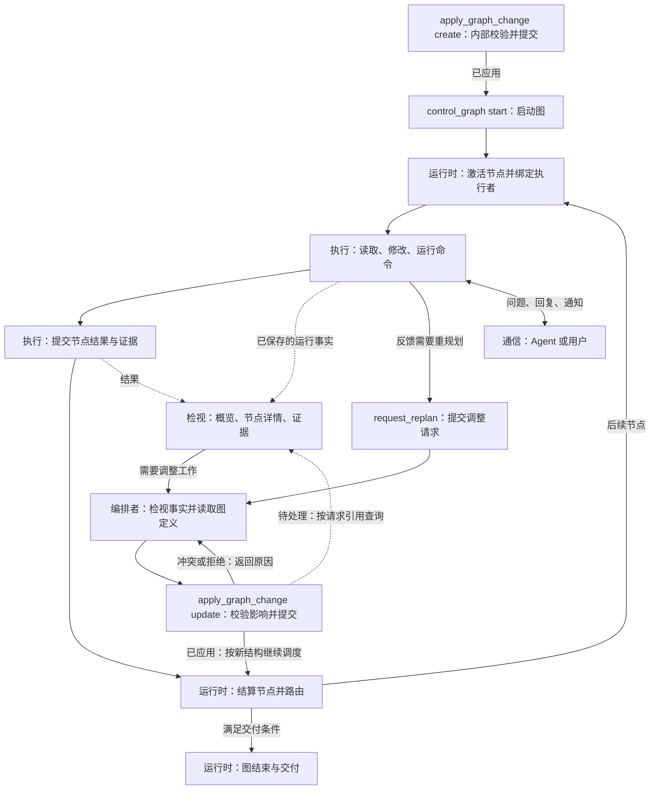

# 历史工具契约：agentTask 切换前

以下原文仅保留当时设计和验证事实，已由当前工具契约替代。

# 四类工具定义与落地契约

创建日期：2026-09-07。最近修订：2026-09-09（新工具、调用方、运行事实与版本切换）。

状态：核心工具、新调用链、文档和删除对账已完成本地验收。第 1–11 节描述当前接口；第 12 节保留 SWE 适配调查计划，第 13 节记录实际验证。不能以历史批次替代新版测试。

## 1. 已确定的方向与本稿边界

- 工具分为执行、编排、检视、通信四类。这是工具职责分类，不是 L1–L5 的新分层，也不要求对应四个 Go 包。
- 执行用于完成当前节点任务；编排管理图定义、结构及生命周期；检视读取图、节点与 Agent 的运行事实；通信传递问题、回复和通知。
- `run_shell` 保留在执行类。
- 删除独立 `run_check`，测试命令统一通过 run_shell 执行。测了什么、测的是哪份代码和测试判定完全交由 Python 测试程序负责；AgentGo 不新增或迁移这类专门检查语义到 run_shell。所有 Agent 的每次 run_shell 调用均保存通用执行事实。
- 文件写入统一由 `apply_change` 承担，包括创建和修改；替代原 edit_file/write_file 的分立入口。文件变更与 `apply_graph_change` 的图结构变更分别处理。
- 删除 `submit_change_decision` 及其机械前置关卡。“先说明决策，再读取和修改”只作为提示词工作要求，不用新工具、自然文本解析器或结构化回执继续强制同一流程。
- 删除强制 Observation 机制，包括 record_observation_delta、单工具检查阶段、观察报告、回执等待及其派生行动约束。按策略轮数、累计新知识轮数、无进展次数、探索限额、默认预算耗尽等触发强制记录、停止、切换 Attempt 或恢复交接的规则一并删除，不仅删除 record 工具名称。
- 观察通过 inspect_board、inspect_node、read_evidence 读取执行事实；不要求模型填写报告来换取继续执行资格。运行时监测继续由现有 watchdog 负责，watchdog 代码不改，也不把被删除的阈值逻辑搬入 watchdog。
- `send_message` 仅传递信息：不唤醒或中断 Agent，不创建 Task/Activation，不改变任务、图结构或生命周期。消息类型、优先级和正文均不得赋予它控制作用。
- **不实现 `rw_stdin`**，本方案不增加交互式进程会话、后台进程句柄或对应读写工具。`run_shell` 返回前完成执行或明确报告失败、超时、取消；不以自行后台化的命令绕过生命周期管理。
- 前期讨论仅更新文档；2026-09-09 用户已授权按本文实施 L3–L5 关联变更并更新 AGENTS.md、测试 YAML 和必要的 Go/Python 测试代码。验收执行 Go 测试与构建，SWE 测试暂不执行；全部完成后提交并推送。不能通过改配置完成隐式切换。
- 编排类确定使用 `read_graph_definition`、`apply_graph_change`、`control_graph`、`request_replan`。初次建图与运行中改图共用一套工具，校验与提交在 `apply_graph_change` 内完成，不要求模型管理草案或单独调用校验、提交工具。
- 核心目录及首版参数按本文落地；未在 schema 中声明的能力不能仅由名称推导。工程细化不恢复已决定删除的工具或控制链。

每个工具统一用三项描述：**工具名称、权责范围、定义**。“三项描述”不改变“四类工具”的分类数量。

## 2. 分类规则

| 类别 | 核心问题 | 边界 |
|---|---|---|
| 执行 | 如何完成当前节点任务？ | 项目读取、搜索、变更、命令、测试和节点结果提交；不直接修改图 |
| 编排 | 工作如何组织和推进？ | 图定义读取、创建与动态变更、生命周期管理和重规划请求；校验提交由工具内部完成，不代替节点执行 |
| 检视 | 实际执行到了哪里，产生了什么？ | 读取运行状态、记录和证据；不借查询触发重试、提交或状态迁移 |
| 通信 | 需要向谁传达或询问什么？ | 消息和问答；投递不代表对方接受、开始执行或完成工作 |

`read_file` 读取项目文件，属于执行。读取保存的工具输出和任务产物证据属于检视。读取图定义属于编排，读取图运行状态属于检视。运行测试属于执行，查看已有测试记录属于检视。

分类按正式契约固定，不根据模型填写的用途临时改变。即使 `run_shell` 运行搜索命令，它仍属于执行工具。

## 3. 执行类：4 个入口

### 3.1 run_shell

- **工具名称**：`run_shell`，已确定保留，归入执行类。
- **权责范围**：在当前节点绑定的工作区中运行一次有界命令。覆盖目录查询、搜索、构建、测试及其他命令行操作。不承担消息传递、图管理或框架状态文件修改。
- **定义**：接收命令及工作目录，在当前节点的执行环境中运行，返回标准输出、标准错误及执行结果，包括退出码或失败、超时、取消状态。它是节点任务的通用命令行执行入口，运行测试也是其用途之一；命令成功不等于节点任务完成。通用回执包含退出码及作用域或明确失败状态，ShellExec v2 记录 process_started、耗时和可选退出码；完整输出或引用保留在工具结果中。

**已确认的记录边界**：每次调用都记录实际命令、执行者及所属任务、执行状态、输出和退出结果；取消或执行结果不确定时如实记录。AgentGo 不识别某条命令是否是测试，不要求 check_id/exact_command，不生成测试专用 CheckRecord，也不绑定被测代码版本。Python 测试程序负责测试内容、被测代码及测试结果判定。通用执行环境、文件产物和任务身份记录仍服务于执行审计，不能据此重新引入测试专用门槛。

### 3.2 read_file

- **工具名称**：`read_file`，保留名称。
- **权责范围**：读取当前节点工作区中的项目文件，为调查和修改提供准确内容。不提供框架内部日志、跨节点私有工作区或任意 ContentRef 的文件路径旁路。
- **定义**：输入项目相对路径与可选行段；输出实际路径、行段、内容、内容版本及截断信息。读取不推进节点状态。后续编辑应能关联此次读取的内容版本，并检测跨 Agent 修改造成的过期。

### 3.3 apply_change

- **工具名称**：`apply_change`，采用能够覆盖文件创建与修改的名称。
- **权责范围**：对当前节点工作区提交明确的文件变更，登记产物与变更前后版本。不操作 Graph 或框架历史文件。
- **定义**：接收明确的文件变更并应用到当前节点工作区，覆盖创建、修改及文件写入需求，返回实际差异、执行结果和产物引用。首版 schema 使用 operation=create/write/replace，分别仅新建、创建或覆盖、精确替换；没有“只能编辑已有文件”的限制。未声明的目录管理或多文件事务不由工具名称推导。文件变更不经过 apply_graph_change。

旧 edit_file/write_file 的 handler 已删除；文件访问、并发控制和产物记录在统一实现中完成，没有转发别名。先说明决策是提示词要求，不恢复 submit_change_decision 的执行门槛。

### 3.4 submit_task_result

- **工具名称**：`submit_task_result`，保留名称。
- **权责范围**：提交调用者当前节点的执行结论、产物和证据，不替其他节点提交结果，不直接启动下游。
- **定义**：输入当前角色允许的终态声明、结构化结果、摘要和证据引用；blocked 必须包含原因。运行时验证角色契约、证据和持久化后进入唯一终态收口。返回提交回执；后续图路由由运行时完成。Verifier 的 verdict 属于其节点执行结果，不能用普通测试退出码替代。

## 4. 编排类：4 个已确认的设计入口

本节定义已接入的图接口。模型表达要创建的图或要应用的变更；运行时执行校验、准入和事务提交。草案可以是内部临时对象，不要求模型创建、维护或提交草案。

### 4.1 read_graph_definition

- **工具名称**：`read_graph_definition`。
- **权责范围**：读取正式图的节点规格、边、路由、验收规则及定义版本，为初步了解和动态变更提供结构依据。节点执行进度和结果通过检视类获取。
- **定义**：输入明确的图引用，可指定历史 revision 或读取当前版本，可按节点或结构片段读取；返回实际 revision、定义内容和分页信息。同次分页必须绑定同一版本。可附 Agent 模板/能力目录引用，不将模板声明当作活跃 Agent 状态。对象不存在时返回未找到，读取不创建对象、不改变图状态。

### 4.2 apply_graph_change

- **工具名称**：`apply_graph_change`。
- **权责范围**：创建正式图，或修改已有图（包括正在运行的图）的定义与结构。内部完成结构、权限、能力、输入输出、执行影响和所需准入校验，再提交变更。创建成功不自动启动图；运行图变更成功后由运行时按新结构继续调度，不要求再次启动整图。不替节点执行任务，不改写已经发生的执行事实。
- **定义**：使用显式 `operation=create/update` 区分两种请求。创建输入完整图定义；修改输入 `graph_id`、`expected_revision`、结构化 `changes`，以及对受影响在途节点的明确处置。运行时绑定调用身份，并以稳定请求身份关联校验、准入和提交。成功返回图引用、新 revision、added/changed/removed 节点差异摘要、定义摘要及提交回执；失败返回原因、错误位置或冲突事实，正式图不留下部分变更。模型无需另交校验报告或再调用提交工具。

**动态变更与事务边界：**

- 未开始的节点可以在校验通过后调整定义、依赖或删除；尚未开始执行但已经冻结的 Activation 也必须纳入影响检查，不能只看 pending 状态就原地覆盖。
- 正在执行的节点不得被悄悄换目标。本版通过 in_flight=preserve 明确让本次执行继续；当前已冻结的执行定义保留，变更影响未来 Activation。已完成节点保留结果和证据，需要返工时建立新的执行实例。
- 变更准备期间，不受影响的工作可以继续。图 revision 与节点运行状态可能分别变化，因此提交时须在一致的提交边界重新检查基础版本和受影响执行状态；仅检查图 revision 不足以防止并发冲突。
- 校验、必要的 Proposal Acceptance 和提交属于同一次请求的内部流程；机械通过不等于全部准入通过。不得因合并工具而取消必要的校验或让模型机械补调另一入口。
- 本版采用同步准入与 preserve，不提供“取消后等待结算再改图”的后台执行路径。等待调用队列或准入时可取消，取消/中断不等于应用成功；已形成的事务按 source_request 检视。后续若增加待处理状态，必须先定义其持久化和重新校验契约。
- 回执区分已应用和明确拒绝/冲突；执行中断导致结果无法确认时如实报告不确定，并允许按请求身份查询持久化状态。同一请求重试不重复创建图或重复应用变更；修改内容后形成新的请求。
- 校验失败不改变正式图；取消在途任务等控制副作用无法用结构回滚抹除，须单独记录其接受与结算事实。不能把图定义事务原子性表述为所有外部副作用均可回滚。
- 终态图不能通过 update 隐式复活。当前只接受新契约与合法的 preserve 更新；版本与目录边界见第 11 节。

**同一入口的两种用法（完整字段以 schema 为准）：**

```text
apply_graph_change(operation=create, request_id=稳定请求身份,
                   definition=完整图定义, contract=目标与交付契约)
apply_graph_change(operation=update, graph_id=目标图,
                   expected_revision=所依据的版本,
                   request_id=稳定请求身份, changes=结构变更,
                   in_flight=preserve, reason=修改原因)
```

### 4.3 control_graph

- **工具名称**：`control_graph`。
- **权责范围**：控制已提交图的生命周期，不修改图定义，也不允许直接改写节点的业务成功状态。
- **定义**：首版动作仅为 `start` 和 `cancel`，使用 graph_id、expected_revision、action；cancel 必须提供 reason。运行时检查当前状态和控制权限，start 身份由图派生并幂等，返回启动事务或取消请求回执，实际状态通过检视读取。重复请求不得重复启动；取消请求被接受不意味着在途副作用已经结算，进展通过检视类查询。暂停、恢复、单节点重启和跳过节点不纳入首版。

图取消所需的运行时事务在实施阶段对账；本节确认工具职责，不宣称当前代码已支持新入口。启动仍遵守历史会话不自动续跑。

### 4.4 request_replan

- **工具名称**：`request_replan`，保留名称。
- **权责范围**：当前节点向具备编排权限的主体提交调整图的请求，不直接修改图，也不通过普通消息获得编排权限。
- **定义**：输入原因、相关运行事实或证据引用、建议调整范围；运行时绑定来源节点和任务，返回重规划请求回执。具备编排权限的主体通过检视和 read_graph_definition 获取当前情况，再决定是否调用 apply_graph_change。重规划请求被接受不等于图已经改变；决定无需改变时也须有明确的请求处理结论，由 submit_task_result 的 result.decision=no_change 与 summary 记录。Graph 终态后的请求只按明确策略记录或拒绝，不隐式复活图。

## 5. 检视类：3 个入口

### 5.1 inspect_board

- **工具名称**：`inspect_board`，当前名称；承担“阅读公告板”的运行概览需求。
- **权责范围**：查询授权 Session/Run/Graph 范围内的节点、Agent、任务状态和资源使用概览；不创建任务，不唤醒 Agent。
- **定义**：输入运行范围及节点状态或 Agent 过滤条件；返回带观测时间和一致性边界的有界概览，包括活动任务、执行者、上下游结算情况、终态和详情引用。支持按编排请求引用查询变更或控制请求的处理状态、冲突原因及生效版本；新图尚未创建时也可按授权请求身份查询，不要求已经有 graph_id。展示活跃 Agent 与模板目录时明确区分。不得默认扫描全部历史 Session。

### 5.2 inspect_node

- **工具名称**：`inspect_node`，当前名称。
- **权责范围**：检查自己或其他授权节点的执行详情、结果与因果关系，不把“查询”变为等待任务完成的隐式控制操作。
- **定义**：输入图、节点及必要的 Activation/Task/Attempt 选择条件；可选择状态、结果或执行记录视图，返回版本化状态、工具调用回执、失败事实、消息关联及证据引用。存在多次 Activation 时返回索引或要求明确选择，不混合各代结果。无结果、尚未运行和已经失败是不同状态。

### 5.3 read_evidence

- **工具名称**：`read_evidence`，当前名称。
- **权责范围**：读取已经保存的命令输出、文件产物和其他执行证据，不启动命令，不生成测试判定，不修改证据。
- **定义**：输入运行时返回的真实类型化引用及可选分页条件；返回来源调用、Task/Attempt/Activation、适用的产物身份、摘要及内容。不同引用类型分别验证和解析，不当作可互换字符串。Python 测试输出可作为普通命令输出读取，其测试语义由测试程序负责。动态内容不可用时明确报告，不拿当前文件冒充历史产物。

日志分页位置使用独立查询契约，不复用 L2 的 `eventCursor`。流式事件游标 / SSE events cursor 仍专用于 L2 模型输出订阅；检视工具不替代 UI 的实时订阅接口。

## 6. 通信类：2 个入口

### 6.1 send_message

- **工具名称**：`send_message`，已确认保留，仅传递信息。
- **权责范围**：在授权协作范围内传递问题、回复和通知。除消息自身的投递与记录外，不改变任务、图、权限、验收状态或执行结果；不唤醒或中断 Agent，不触发新任务或 Activation。
- **定义**：输入明确接收者、消息类型、正文、可选证据引用和 `reply_to`；发送者及所属任务身份由运行时绑定。返回消息身份和投递回执。已持久化、已投递、已读、已回复分别表达；消息成功不表示对方接受工作。正式任务委派通过编排完成，不靠消息正文建立隐藏任务依赖。

**已确认的行为边界**：收件 Agent 仅在正常执行流程的消息接收点获得信息；空闲时不因消息开始执行，正在执行时不被消息强制打断。图已终态时消息也不使其恢复或产生图外工作。消息中的问题或建议可以供接收者在正常执行时判断，但不能作为自动派发任务、修改图或确认结果的指令；实际动作仍通过相应执行或编排契约完成。

首版参数为 to、content、可选 summary、msg_type=info/question/reply、reply_to；reply 必须关联消息。to 为真实 Agent ID，现有广播 * 同样仅投递信息。不接受 steer/priority 等控制参数，投递使用 DeliveryOnly，不自动 ACK 或唤醒。

### 6.2 request_user_input

- **工具名称**：`request_user_input`，保留名称。
- **权责范围**：向用户获取当前任务缺失的信息或选择，不代替 Shell 授权、图审批或终态提交。
- **定义**：输入明确问题及可选受约束选项；返回关联请求的用户回答或明确取消状态。用户未回答不等于批准。等待期间的取消、deadline 和恢复沿用明确的运行策略，不由自然语言消息绕过。

## 7. 统一审计与多代理边界

四类共用调用回执原则，不共用一个可以任意执行所有动作的万能工具：

- 运行时绑定 Session、Run、Graph、Node、Activation、Task、Attempt、Invocation、ToolCall 等适用身份；不适用字段保持缺席，不由模型伪造关联。
- 请求包含明确的目标对象和版本，回执包含实际结果、失败类别、证据引用和时序。模型给出的“目的”只作说明，不作行为权威。
- 执行事实、模型判断、消息陈述、正式结算分别标识。Shell exit=0、节点 completed、验收 pass、Delivery committed 不能互相替代。
- 跨节点读取需要保持来源身份；共享工作区需要保持实际版本与并发控制。容器负责环境隔离，不能代替候选版本和因果记录。
- 大输出有界返回并给出完整内容引用；分页明确，不静默截断后假装完整。修改与取消的结果不确定时如实记录，不自动重复副作用。
- 类别不直接授予权限。Worker、Scheduler、Verifier 按角色持有子集；不能把本目录全部工具一次性暴露给所有 Agent。
- 自动上下文注入、订阅、状态结算仍可由运行时完成，不为凑全工具目录要求模型调用一次。

目标目录共 **13 个入口：执行 4、编排 4、检视 3、通信 2**。核心目录与消息信息边界已落地。这是跨角色工具目录，不是每次请求的工具列表，也不是固定数量验收指标。可选 Web/Team 能力和内部 Proposal Acceptance 操作单列，不伪装为已删除的 Agent 业务工具。

## 8. 旧工具处置与职责承接

本表区分已确认的目标处置与仍需补齐的迁移工作，不是已完成代码删除的证明。

| 现有入口 | 目标类别与方向 | 实施前必须解决 |
|---|---|---|
| read_file、edit_file、write_file | 执行：保留 read_file，写入统一为 apply_change | 迁入文件访问、并发校验、产物及 Effect 记录；旧写入入口退役 |
| list_dir、grep_search、glob_search、probe_directory | 执行：由 run_shell 承担命令查询与搜索 | 当前 Explorer 的只读能力与证据范围、跨平台命令、输出预算；不能仅删配置 |
| run_shell、run_check | 执行：保留 run_shell，删除 run_check 及 AgentGo 测试专用语义 | 清理 Graph/Lease 的旧 raw Shell 禁令和 CheckContract/CheckRecord 依赖；所有调用保留通用执行事实，测试语义由 Python 测试程序负责 |
| web_search、web_fetch | 执行：不列入最小 SWE 候选集，按业务保留可选能力 | 搜索服务能力不能假定等价于普通 Shell 下载；不能据此删除通用产品需求 |
| submit_task_result | 执行：保留 | finalizing 优先级、证据验证、唯一终态不变 |
| record_observation_delta、submit_change_decision | 已确定删除工具及强制记录/决策机制 | 同步删除 L3 单工具阶段、L4 阈值触发、回执等待、派生行动约束和测试程序强制检查；不迁入 L2、watchdog 或另一工具 |
| submit_recovery_decision | 删除模型工具；图变更通过四工具接口，结论通过 submit_task_result | 旧默认恢复控制流程不再要求该工具；历史 Recovery 数据不转换成新请求 |
| request_replan | 编排：保留明确的请求入口 | 请求与变更生效分离 |
| publish_task | 编排：图内工作统一经图定义安排 | 模型 publish_task handler 已删除；显式用户 Reactor 的任务发布动作属于独立业务接口，不是同名模型工具 |
| submit_graph、patch_graph、create_graph_draft、configure_simple_graph_draft、patch_graph_draft、propose_graph_change | 编排：apply_graph_change 的 create/update 请求 | 取消模型管理草案的必经流程；内部保留必要的暂存、验证和事务机制，区分初建与运行图变更 |
| read_graph、read_graph_draft、read_graph_change | 编排：read_graph_definition；请求与运行状态转检视 | 内部草案不再作为模型必须管理的对象；定义、请求状态和运行事实分别有明确权威 |
| validate_graph_draft、validate_current_graph_draft、validate_graph_change | 编排：apply_graph_change 内部校验 | 不再要求独立模型调用；绑定请求、版本及执行状态，保留必要的 Proposal Acceptance |
| commit_graph_draft、commit_current_graph_draft、commit_graph_change | 编排：apply_graph_change 内部提交 | 与校验合为一次请求，保留事务、准入、幂等与未知结果语义，不增加旧工具转发 wrapper |
| start_graph、start_current_graph、cancel_task | 编排：control_graph 的 start/cancel | 单节点取消不等同于整图取消，不自动扩大新入口能力 |
| submit_graph_change_decision | 删除模型工具；submit_task_result 记录协调请求的 no_change 结论 | 必须保留 no_change 的持久化结论，不用自然文本退出替代 |
| get_task_result、read_content_ref | 检视：inspect_node、read_evidence | 引用类型、完整内容与访问范围；当前 Scheduler 专用查询不能直接视为全角色可用 |
| list_agent_templates、provision_agent_team | 编排：资源目录与执行团队配置，最小集外能力 | 动态 Team/Spawn 若继续支持，需要另列扩展工具；不能把模板查询当作运行检视，也不能假定创建图就完成资源配置 |
| report_progress、report_done | 删除模型工具；检视接口读取事实，submit_task_result 提交作用域内最终汇报 | 保留 Run/Graph final-report 与节点结果的不同作用域；不能直接给 submit_task_result 加别名 |
| send_message、request_user_input | 通信：保留；send_message 仅传递信息 | send_message 的唤醒与任务触发关联须移除；投递、回复链与用户问答契约分别对账，不把旧控制行为带入新定义 |

以上按删除、迁移和重写分别对账；新的同名业务字段或内部组件不能恢复旧工具入口。阶段实际删除与验证见第 13 节。

## 9. 典型调用流程



图中“需要调整工作”必须经过有权限的编排者，不表示任意检视者都能修改图。动态变更不重新走整图启动，也不重复结算已经完成的节点；箭头指向运行时按新定义继续调度。普通成功流无需额外发消息唤醒下游，图路由负责依赖推进。冲突反馈供重新判断，不代表无条件自动重试。

## 10. 已确认删除范围与实施准备

### 10.1 已结束的行为讨论

run_check 删除，测试语义交给 Python 测试程序；run_shell 每次保留执行事实。文件写入统一到 apply_change。submit_change_decision 与强制 Observation 一并退役，不再要求模型填写记录才能继续工作。编排四工具和消息仅传递信息已确认。watchdog 不改。

### 10.2 强制 Observation 与策略阈值的删除清单

| 必须删除的内容 | 主要调查入口 | 完成判据 |
|---|---|---|
| record_observation_delta 注册、schema、自动补充、独立模型调用及专用探针 | internal/tools/observation.go、internal/observationcontract、internal/config/framework_tools.go、Observation probe 装配 | 新任务无需声明或探测该能力，不产生该调用；不能只把注册隐藏 |
| Observation-only ToolRouter、强制提示、pending marker、回执等待及 mutation commitment | internal/agent/scheduler_tool_phase.go、llm_executor.go、agent.go | 合法业务读取/修改不因缺 Observation 被拒绝；不再把回执作为下一步许可 |
| 周期决策/知识检查、无进展计数、探索轮数、决策停滞阈值及默认预算触发的停止/恢复 | internal/agent/loop_progress.go、internal/policycatalog、相关 Run/Progress 默认策略 | 删除这些默认规则及其控制分支，不改成更大数值、默认关闭开关或另一个版本的同类约束 |
| 为历史裁剪、Attempt 切换、预算耗尽或恢复交接而强制补交观察记录 | internal/agent/agent.go 与上下文/任务记忆接缝 | 这些路径不等待模型自评报告；裁剪仍保留必要的工具调用/结果关系和执行事实 |
| 基于缺报告、观察停滞或阶段外 record 调用生成的拒绝、重试、blocked 与恢复请求 | L3 校验、L4 错误处理、L5 恢复接入 | 不再因为被删除的规则改变任务状态；实际执行错误与主动重规划仍按对应契约处理 |
| SWE Test Runner 的 Observation 活探针前置检查、检查点次数门槛和 record 阶段断言 | scripts/swe_test_runner/runner.py 的 preflight_observation_probe、控制调用与架构检查；对应 fixture/测试 | 新运行没有 record 调用也能通过；不再因已退役的检查点规则判为架构失败 |
| 活动提示词、配置、策略说明与测试中对上述机制的承诺 | prompts、config fixtures、AGENTS.md、活动设计与测试文档 | 生产调用方和测试不再要求旧路径；旧磁盘日志按历史事实保留，不用旧断言评价新运行 |

这里的“阈值删除”包括前文列出的周期轮数、新知识累计、无进展/探索限额、默认预算耗尽，以及由此产生的强制报告、停止和恢复交接。统计可以用于展示，不能换名后继续作为上述控制门槛。默认阶段时间预留与自动 handoff 若承担同样的强制推进作用，也须纳入调查和删除，不只清理 record 的直接调用点。

不把“默认进展策略阈值”与用户明确设置的执行限制、HTTP/进程超时、真实 provider 配额错误或 watchdog 现有保护混为一谈。后几项的具体处理范围需在实施清单中逐项说明，不能据本次决定顺手删除整个取消与故障处理系统，也不能以其名义恢复已退役的默认进展关卡。watchdog 源码保持不变。

原报告曾服务于任务记忆、Context 投影与恢复。清理依赖时以原始执行事实和检视接口承接必要数据访问，不创建新的强制模型摘要工具，也不声称现有 watchdog 已经具有相同的模型语义判断能力。

### 10.3 剩余实施准备

1. 完成参数、返回、分页、权限、事务及错误 schema；这些属于工程设计，不重复询问已确认的行为方向。
2. 列出 CheckContract、CheckRecord、Graph fulfillment/验收与 Python 测试程序的实际解耦路径，确保不把测试语义偷偷迁入 run_shell。
3. 对照本节列出文件级删除、迁移、重写和调用方切换清单；对账恢复裁决、无变更收口、final-report 和动态团队的剩余职责。
4. 明确新版本与旧会话/策略数据的恢复或拒绝边界；当前冻结规范描述旧实现，后续实施须同步更新，不能以冻结为理由保留已决定删除的目标行为。
5. 验证合法调查可以连续进行、不再生成强制报告或因轮数转入恢复；逐次 Shell 事实完整，四类工具协作和图动态变更可执行；确认 watchdog 源码未变。同步执行 Go 回归、Python 测试和真实二进制产物检查。

当前实现状态只以第 13 节证据为准；不把旧测试结果当作新工具集证明，不创建旧接口转发 wrapper。

## 11. 当前接口与实现索引

| 接口 | 核心输入 | 返回与错误边界 |
|---|---|---|
| run_shell | command、working_dir、timeout_sec；管道需显式接受末段退出码语义 | stdout+stderr、退出码/作用域或失败；每次调用有身份与通用执行事实，不解释测试 |
| read_file | path、offset/limit、force_full | 实际文件内容/行号/哈希与截断信息；缓存使用前检查新鲜度 |
| apply_change | path；create/write 使用 content，replace 使用 old_str/new_str；可选 expected_hash/line_anchors | 路径、operation、字节数、变更前哈希和新 SHA256；错误类型、版本冲突与混合参数在写入前拒绝 |
| submit_task_result | summary、status、result、evidence 等；blocked_reason 或验收 verdict/cited_evidence 按角色要求 | 唯一终态回执；原始入口 Scheduler 不直接回答完成，final-report/coordination 按自身作用域收口 |
| read_graph_definition | graph_id、可选 revision/node_id、offset/limit | 版本化节点定义；后续页必须指定 revision，不能分页拼接不同版本 |
| apply_graph_change | create/update、request_id；创建 definition/contract；更新 graph_id/expected_revision/changes/reason/in_flight | graph-apply-receipt/v1，包含版本、定义摘要、source_request 与 diff；错误保留原因，不留部分正式变更 |
| control_graph | action=start/cancel、graph_id、expected_revision；cancel 的 reason | 幂等启动事务或取消请求；没有隐式恢复/跳过能力 |
| request_replan | 原因、证据与建议范围 | 请求回执，不直接修改图；终态图不被复活 |
| inspect_board | graph_id/agent_id/status；offset/limit/snapshot_digest；可选 request_ref | 当前 Run 概览与事务状态；版本变化拒绝后续页 |
| inspect_node | task_id 或 graph_id/node_id/activation_id，可选 attempt_id；无条件时自查 | 状态、结果与 details_ref；歧义/旧 Attempt 不伪装成当前 |
| read_evidence | ref_id、可选 graph_id、分页参数 | 授权内容或 Graph Result/Evidence；校验作用域与引用，不读任意业务路径 |
| send_message | to/content，msg_type/summary/reply_to | message-receipt/v1，投递成功不代表已读或已执行 |
| request_user_input | 问题与可选选项 | 关联请求的回答或取消；未回答不等于授权 |

字段的正式 JSON schema 与错误检查位于 [internal/tools](../../internal/tools)，完整请求由 L1/L2 契约承载，不通过 context 隐藏模型请求选项。

- 注册与授权：[known_tools.go](../../internal/tools/known_tools.go)、[execution_lease.go](../../internal/agent/execution_lease.go)、[scheduler_tool_phase.go](../../internal/agent/scheduler_tool_phase.go)。
- 执行：[shell.go](../../internal/tools/shell.go)、[local_read.go](../../internal/tools/local_read.go)、[local_write.go](../../internal/tools/local_write.go)、[submit_result.go](../../internal/tools/submit_result.go)。
- 图：[graph_authoring.go](../../internal/tools/graph_authoring.go)、[graph_schema.go](../../internal/tools/graph_schema.go)、[graph_routes.go](../../internal/tools/graph_routes.go)，以及 internal/graph 的事务和 Runtime。
- 检视与通信：[inspection.go](../../internal/tools/inspection.go)、[content_ref.go](../../internal/tools/content_ref.go)、[graph_evidence.go](../../internal/tools/graph_evidence.go)、[meta.go](../../internal/tools/meta.go)、[agent_question.go](../../internal/tools/agent_question.go)。
- 事实与模型输出：[tool_call_identity.go](../../internal/agent/tool_call_identity.go)、[llm_executor.go](../../internal/agent/llm_executor.go)、internal/contextruntime/output.go、internal/trace。
- 版本与恢复：[冻结基线](contract-freeze-2026-08-30.md)、[五层文件索引](five-layer-engineering-architecture.md)、[AGENTS.md](../../AGENTS.md)。

### 11.1 可选 Team 的初建接缝

启用 agent_templates 后，Scheduler 的工具视图暴露 list_agent_templates/provision_agent_team。初建 Team 使用 graph_request_id，与随后 apply_graph_change(create) 的 request_id 完全相同；运行时按当前创建任务与该请求值派生同一个 graph_id。Team 返回真实 ready event_type，之后才把它写入节点 metadata.route。无需恢复 create_graph_draft 或允许模型猜测图 ID。

图内 controller 扩容继承当前 Graph（可用 graph_id 显式核对）；普通业务节点与 final-report 无 provisioning 权限。非图初建必须绑定 graph_request_id，不提供旧 task-scoped 模型入口。已有内部 Team 管理 DTO 与显式业务调用不作为模型工具旁路。

## 12. SWE Test Runner 适配计划

调查日期：2026-09-09。重新核对了 Python 入口、pytest reporter、SSE 解码、相关单元测试、配置模板、SWE 角色提示词、Flask-8 manifest、真实二进制 fixture 和 CI，并与正在修改的 Go 工作区逐项对照。**本章保留调查基线与适配计划，不是已完成的测试报告；后续实际修改和验证状态见第 13 章。** 调查时主程序及部分 YAML/提示词已在工作区修改，Python 仍消费旧契约；不能将这一中间状态视为完成配套更新。适配必须与主程序新契约一起切换，不能先让测试忽略旧机制而主程序继续运行它。

### 12.1 当前代码与实际耦合

| 文件 / 函数 | 当前行为 | 更新方向 |
|---|---|---|
| [runner.py](../../scripts/swe_test_runner/runner.py)：command_task、command_batch、execute_task_locked | 能力探针 → prepare → 启动 AgentGo → 收集运行结果 → judge → 汇总 | 保留完整事务入口，更新各步骤消费的契约 |
| runner.py：build_run_contract、inject_request、targeted_check_command | 注入 RunContract v2、swe/v3、180/120/90 秒阶段预留、hard kill 前 60 秒预留、targeted/verification exact CheckContract；要求 timeout 至少 480 秒 | 删除测试专用字段和默认阶段控制；测试命令留在 Python，Run 身份与必要通用关联按新运行契约传递 |
| runner.py：preflight_probe、preflight_observation_probe、full_observation_probe_matrix、command_probe | 通用 typed function-call 探针之外，额外调用二进制 Observation probe；probe 命令执行多版本/多 fixture 矩阵 | 删除整个 Observation 探针分支，保留通用 SSE 工具调用能力验证 |
| runner.py：trace_metrics、loop_metrics、collect_result | 对 Observation 次数、恢复 first-action gate、草案调用序列、默认进展失败与旧阶段窗口做机械判定 | 按新工具事务和真实执行事实重写，删除旧流程要求 |
| runner.py：context_metrics | 仍读取 state/context-snapshots/context-snapshots.jsonl，未切换当前 v2 目录，也没有 Run 过滤 | 修正读取版本与关联范围，避免成功调用被统计为零 Snapshot 或混入别的运行 |
| runner.py：prepare_task、run_pytest、judge_task、verify_candidates | Python 已执行目标红态、全量基线和最终全量 Judge；维护测试文件基线，生成补丁 | 保留判题权威，在 Python 内补齐每次正式测试的命令、执行环境及被测代码身份 |
| [agentgo_swe_pytest_reporter.py](../../scripts/swe_test_runner/agentgo_swe_pytest_reporter.py) | 按 nodeid 和 pytest 阶段计数；处理 call failure 与 teardown error 重叠 | 复用有效计数算法；它是 pytest 插件，不是要求模型填写的 Observation 报告 |
| [setting.swe-flask.yaml](../../setting.swe-flask.yaml)、[prompts/swe](../../prompts/swe) | 工作区已使用 apply_change、检视工具并移除 observation_model；Explorer 已声明 run_shell、Verifier 无 Shell，但仍有“无网络”等旧注释及通用修复段落与角色冲突 | 对照实际租约检查配置、提示词与 Python fixture，删除矛盾描述；不得将部分文本更新当作端到端接入已完成 |
| [runner_test.py](../../scripts/swe_test_runner/runner_test.py)、[sse_test.py](../../scripts/swe_test_runner/sse_test.py) | 同时覆盖通用基础设施和大量旧运行机制 | 迁移有效不变量，删除退役机制的正向断言，新增新入口与缺失事实的回归 |
| [local_fake_provider_smoke.py](../../scripts/local_fake_provider_smoke.py)、[verify.yml](../../.github/workflows/verify.yml) | fixture 明确生成 record_observation_delta、submit_change_decision、run_check 和草案步骤，要求这些调用出现 | 同步重写真实二进制 fixture；两个 SSE 协议和跨平台 CI 保留 |

现有 collect_result 还把 `first_prompt_at_most_8000`、`graph_draft_within_5_calls` 作为 architecture_checks。这些是经验门槛，必须删除；调用量与 token 可展示，不能继续因超过固定次数而认定架构失败。

### 12.2 Python 判题与 AgentGo 执行事实分离

1. **AgentGo 侧**只返回通用图/任务结果、文件产物与逐次 Shell 执行事实。不接收 SWE check_id、test_files、exact_command 等机器检查字段，不生成 CheckRecord，不判断被测代码版本或测试通过。
2. **Python 侧**从 tasks.csv、suite.json 决定正式测试范围，prepare 验证目标红态及全量基线，judge 对实际交付执行全量测试；verify_candidates 保持干净基线 → golden tests 红态 → golden source fix 绿态的题目有效性验证。golden source fix 仅用于候选题自检，不进入 Agent 的修复输入。
3. Agent 可以经 run_shell 自行运行测试用于诊断，其输出作为普通执行结果返回。正式 Judge 必须由 Python 独立执行，不能因为模型声称通过或某条 Shell exit=0 就省略。题目仍可用自然语言说明测试命令和禁止修改 tests/；这不是 AgentGo 内部 CheckContract。
4. 保留原始 pytest 输出、JUnit 和 sidecar 阶段计数。`load_pytest_report`/`validate_junit` 已对缺失、非法 schema、计数冲突拒绝，继续使用；不能退回解析终端的“passed”字符串。无测试收集、测试中断、环境错误与业务断言失败分别报告。
5. Python 正式测试新增独立执行记录：测试运行身份、所属题目/Run、阶段、实际 argv、cwd、Python 可执行文件、选中的测试范围、收集数量、开始/结束、退出状态，以及被测源码/测试/依赖环境的版本标识。这是测试程序产物，不回填成 AgentGo 的检查 gate。
6. “测的哪份代码”不能只记录 Git HEAD：Agent 产物可能未提交，并包含新建或删除文件。由 Python 保存基线提交、实际文件集合及内容摘要、待测补丁和环境配置；对正式 Judge 使用稳定的待测副本或在写入者全部结束后冻结并核对测试前后内容。判题过程中出现源码变更或身份不一致，不能把结果归给某个不确定版本。
7. Python 核对实际导入的 Flask 来自被测树，处理 editable 安装、PYTHONPATH、虚拟环境路径穿透。不能因为 cwd 指向候选目录就推断测到了候选代码。这些核对在 Python 内完成，不为 AgentGo 新增测试识别逻辑。
8. 最终 Judge 只评价实际交付产物；失败或隔离中的候选可以另作诊断测试，必须标明 candidate scope，不能冒充已交付结果。保留 Graph outcome、Delivery 结果与 Python verdict 各自独立的事实。
9. 测试防篡改基线按准备完成后的实际字节建立，覆盖受保护测试集合及其增删；扩展检查 pytest 配置和环境是否被用于规避收集。报告“同样数量的失败”不能推断“没有新增破坏”：当前 judge_task 的 red_note 只比较聚合计数，应改成保守表述，或在 Python reporter 增加版本化 nodeid/阶段集合后再比较具体失败。

正式测试记录复用现有 run_dir 的输出体系，新增 schema 时明确版本；无需再造 AgentGo 内部测试账本。原始命令/输出保存在本地执行产物，控制台摘要保持脱敏，不打印密钥或完整模型正文。

### 12.3 输入、配置和角色提示词切换

- build_run_contract 不再生成 check_contracts、exact 检查命令或 verification/recovery/finalization 预留。新的通用运行请求必须与主程序发布的新 schema 一致，不能在 agentgo.run-contract/v2 内静默改变字段含义，也不能靠缺字段触发旧默认值。保留 Run/Session/题目关联。
- targeted_check_command 的安全路径校验与跨 Shell 引用算法可以保留到 Python 测试命令生成中；删除 CheckContract 命名和注入用途。AgentGo 不再解释 manifest 的 test_files。
- run_task 的 240 秒下限与 build_run_contract 的 480 秒下限一起清理。外部 `--timeout` 是用户指定的评测运行上限，保留为 Python 进程管理设置；不转换成 Agent 内部轮次、预算耗尽、阶段预留或自动恢复门槛。轮数/token/耗时只能用于统计。
- 保留四项 provider 环境变量一次性预检及模型去重；角色 fast/flag_ship 选择继续由配置决定，不因删除 Observation 改变业务模型分配。删除 observation_model 及旧 profile/version 注释。
- 按角色配置新工具：Worker 使用 run_shell、read_file、apply_change、submit_task_result 及所需检视/通信/重规划工具；Scheduler 使用已确认四个编排入口及检视/通信；Verifier 保持角色授权，只读取业务结果与外部证据并提交自身结论，不在 AgentGo 内机械解释检查记录。
- 当前工作区已给 Explorer 配置 run_shell，以承接目录搜索；必须继续核对实际租约和执行环境是否允许该工具。不给 apply_change 不等于 Shell 无法写文件，不能依靠命令文本猜测只读，也不能为凑齐新目录给所有角色相同权限。Explorer 提示词中“本角色不承担文件写入”与通用 SWE 段落“在 src/flask 完成修复”、Verifier 中相同修复指令必须消除矛盾。该接缝与主程序一起落实，不修改 watchdog。
- prompts/swe/worker.md 删除 run_check/check_id/CheckStore、record_observation_delta、submit_change_decision、轮次检查和 frozen first-action 的工作流；改为先简要说明决策，使用 read_file/apply_change/run_shell 自主执行，检视已有事实，必要时 request_replan。说明决策不产生新的机械前置校验。
- 检查 explorer.md、verifier.md 及启动 Scheduler 动态指令，删除借旧证据或阶段名称恢复相同强制链的内容。保留问题目标、测试禁止篡改和真实产物要求。
- suite 八题的身份、fix_sha 和缺陷描述保持原题目定义；大部分题目已经只提供普通 pytest 命令，不为工具重构批量改写题意。基线失败上下文仍由 Python 生成并以普通任务材料传入，不要求模型提交 Observation 才能消费。
- 模板“未注册 web 工具所以无网络”的表述不再成立：run_shell 本身可以发起网络请求。若评测继续禁止联网搜索，由测试执行环境落实并明确记录，不能仅靠工具名统计宣称无网络；provider 网络与 Agent 命令环境须分清。

### 12.4 探针、指标与架构判定重建

**删除的旧要求：**

- preflight_observation_probe、full_observation_probe_matrix、preflight_probe 的 observation_configured 分支及 command_probe 对 Observation matrix 的依赖；不以新名称重新探测同一强制报告。
- `observation_checkpoint_retry_storm`、`observation_checkpoint_attempt_limit_exceeded`、`control_checkpoint_unavailable` 及只为 Observation 设置的模型兼容判定；删除相关 phase 特判和结果字段。通用 provider 协议错误仍正常报告。
- 旧 `first_graph_draft_call_index` 门槛、8000 token 首轮上限、基于固定 Attempt 次数的 premature_attempt_exhaustion 判定，以及 loop_metrics 中用于强制通过/失败的观察停滞计数。
- 以 `submit_recovery_decision → recovery_action_gated → first-action` 的固定序列、路径和次数判断新工具是否合规的分支。依靠已删除默认阈值生成的 recovery source、deadline/window 错误不再作为新流程必经事项。
- 不能把所有 Scheduler 非 final-report 批量工具调用一律视为事故；按新入口实际授权和事务结果判定，保留真实 dispatch 与 provider 返回多调用/尾部 skipped 的区别。
- `mutating_fulfillment_complete` 中对 CheckRecord 的依赖退役，改为检查通用产物和交付事务；不可通过把 known_incidents 全部固定 false 来让测试变绿。

**新的事实与回归要求：**

| 检查对象 | 新判定依据 |
|---|---|
| 建图 | apply_graph_change(create) 的有效提交回执与持久化图一致，control_graph(start) 启动合法；不限制模型用了几轮准备 |
| 动态改图 | update 成功后 revision 与差异一致；冲突或非法变更正式结构不变；待处理不被当成已提交，不重复产生副作用 |
| 调查执行 | 连续合法 read_file/run_shell 不因缺 record/decision 或跨过旧轮数阈值被拒绝；新工具 schema 和运行轨迹均没有已退役工具 |
| Shell 事实 | 所有角色按实际 Run/Task/Invocation/ToolCall 关联，每次调用有明确回执；区分派发前拒绝、实际执行、完成、失败、取消与结果未知；不假造重复执行 |
| 文件写入 | apply_change 创建/修改产物与实际文件差异一致；不再要求旧 edit_file/write_file 工具名出现 |
| 通信 | 消息形成投递事实，单独发送消息不新增 Task/Activation、不唤醒空闲 Agent、不改变终态图 |
| 节点与交付 | 唯一终态、结果持久化与交付确认、被影响任务处理、最终产物及 final-report 作用域正确；blocked 与 success 保持区别 |
| L1/L2 | 两种协议 SSE 完整结束、请求/输出身份一致、工具交换完整；取消或截断不伪装成成功 |
| 使用记账 | 模型调用与实际 provider dispatch 对账，Shell 事实与实际工具调用对账；记录数量不作为进展或停止门槛 |

Shell 审计不以“存在 tool_call 日志”替代完整执行事实。进程被外部终止时缺少完成回执应标为未完成/未知；不要求所有已开始调用都伪造一个成功结束。检视投影不得抹掉失败和未知结果。

context_metrics 改读 `context-snapshots-v2` 并验证当前 Snapshot schema，按 Run/Task/Invocation 与 trace、模型输出关联；独立 operation 探针按自己的身份统计，不混入业务 Run。新结果不回退旧目录。关键结果读取不能沿用 read_json/iter_jsonl 的静默默认值或跳过坏行来形成“零事故”：关键文件缺失/损坏单列证据不完整；可选指标不可用与有效的零值分开。

当前 run_budget_metrics 仍可复用实际使用量与未结算调用的统计算法，但须按新运行事实契约接入；不以旧 budget_profile=/v3 推断 ledger 必需性，也不保留旧 phase_settled 的阶段限额执法。操作探针、业务调用和失败前置检查分开计数。

### 12.5 生命周期、结果版本与批次

- monitor_run 继续持有 Popen 并使用 poll 查询。Graph terminal 后必须等实际在途任务和最终交付收口，不以静默一段时间或“应该已结束”提前终止工作。final-report 的具体新映射需与主程序同时更新。
- Python 用户指定的外部 timeout 到达时保存 snapshot、进程与未完成调用事实，再按现有跨平台进程清理策略终止并等待回收。报告外部评测超时，不伪造 Agent 的 no_progress/Observation 失败，不启动自动 recovery。正常完成与超时清理分开处理。
- `result.json` 当前为 agentgo.swe-result/v3，删除字段及改变判定须发布新版本（计划 v4）；新的测试执行记录同样有独立 schema。旧结果保留历史解释，不能由新采集器补默认值后宣称新契约通过。
- 保持架构正确性、Python 测试结果、Graph/Delivery 结果、provider 协议能力和基础设施失败分开。finalize_result 可保留“测试通过 + 有补丁 + 无测试篡改 + Graph success”的完成组合，但每个分量都必须来自新的权威事实。
- Observation 专属 `model_contract_checks` 删除后，通用协议兼容失败和退出码语义需要重写并记录；不是将模型故障统统记为程序架构故障，也不是把未知缺字段默认当兼容。
- 保留 task_execution_lock、.batch_start 新鲜度、每题后及 finally 原子写 batch summary、not_run/基础设施失败分类。普通修复失败可以继续下一题；真正的基础设施或运行契约损坏沿用明确的停止策略。一次未完整执行的批次不能显示成完整八题通过率。
- 保留 Windows ReadOnly 清理重试、UTF-8、路径正斜杠渲染、句柄关闭、测试 raw bytes 基线及端口/进程隔离规则。

### 12.6 测试代码改造清单

| 当前测试组 | 处置与新增回归 |
|---|---|
| test_run_contract_leaves_external_and_phase_reserves、test_targeted_check_command_is_cross_shell_and_rejects_unsafe_path | 重写为不注入 CheckContract/阶段预留，外部 timeout 不变为内部控制；保留测试路径合法性和命令引用检查 |
| Observation invalid_request、retry_storm、preflight_failure、cycle 等测试 | 删除旧机制的正向通过要求，新增新运行不调用 record、不要求 Observation 能力，以及跨旧阈值仍可合法调查的测试 |
| recovery_handoff_v3/v4、stale_or_missing_recovery_gate、loop_intervention_requires_graph_recovery_outcome | 旧协议历史 fixture 留作明确历史验证时须隔离；新入口测试改为实际重规划请求、图变更及合法终态，不强求固定恢复序列 |
| draft_call_index、scheduler_batch、graph_change_progress_exhaustion | 改成 apply_graph_change 的提交/拒绝/冲突/待处理事实；慢建图或多轮准备本身不触发架构失败 |
| setting_renderer、role_model、default_suite | 校验新 profile/提示词一致且不含退役工具与 observation_model；保留模型角色映射、占位符、路径和八题完整性 |
| pytest phase_counter、sidecar、JUnit、baseline_manifest | 保留有效算法；补测试版本身份、源码在测试中变化、实际导入路径穿透、新文件/删除文件、集合篡改和不同失败同计数 |
| monitor、outcome、batch、quota、task lock、Windows cleanup | 保留独立业务不变量；按新结果 schema 更新 fixture，加入超时与 Graph terminal 但仍有任务的区分 |
| context_metrics、通用执行事实 | 新增 v2 Snapshot/Run 隔离、关键文件损坏、不同调用重复日志、Shell 成功/失败/取消/未知、不同 Agent 事实完整性 |
| send_message 与图工具二进制用例 | 空闲接收者不唤醒，终态图不复活；create/update 同入口、非法变更拒绝、合法动态更新继续调度 |

local_fake_provider_smoke.py 必须同时重写 choose_action、返回 schema、生成配置、Acceptance 的 check_ref 假设和最终断言。当前文件明确 assert record_observation_delta、submit_change_decision、run_check 出现，这些断言改为新路径执行且旧工具不暴露/不调用。fixture 只对已知确定场景给出响应，不增加旧工具 fallback。Responses 与 Chat Completions 都经真实二进制跑通；fixture 不能替代真实 provider 验证。

保留 sse.py/sse_test.py 的增量工具参数重组、中文/UTF-8、终止事件、提前 EOF 和错误处理；取消 Observation 探针不意味着取消 SSE 完整性检查。必要时扩展分片与中断覆盖，不放松协议完成条件。

### 12.7 实施顺序与验收证据

1. 与主程序一起冻结新工具和通用运行事实 schema、Graph 测试语义移除后的交付规则；这是测试适配依赖，不由 Python 模拟不存在的产品接口。
2. 更新 Python Run 输入、配置模板和角色提示词，删除 Observation 探针及旧阶段约束；新版本输入明确拒绝旧字段，避免生成器触发旧默认逻辑。
3. 重建 collect_result/trace_metrics/退出码与结果 schema；保留可用的事实算法，替换旧门槛，修复 Context v2 读取和关键文件缺失处理。
4. 在 Python 内补齐正式测试身份与稳定被测副本，保留 prepare/judge/verify-candidates 的真实 pytest、测试防篡改和输出权威。
5. 更新 runner_test、sse_test 与双协议真实二进制 fixture。先执行无网络确定性验证，再在已配置环境进行真实协议定向验证与正式 Flask-8 回归，不在计划编写阶段消耗真实模型。
6. 同步 scripts/swe_test_runner/README.md、setting.swe-flask.yaml 注释、AGENTS.md 中的 SWE 输入/探针/CheckContract/阈值说明、KNOWN_ISSUES 和相关活动文档；记录旧条目修复证据，不用新结果重写历史事实。

实施阶段验证命令：

```text
python -m unittest discover -s scripts/swe_test_runner -p '*_test.py'
go test ./...
go vet ./...
go build -o agentgo.exe .
python scripts/local_fake_provider_smoke.py --binary ./agentgo.exe
python scripts/local_fake_provider_smoke.py --binary ./agentgo.exe --protocol chat_completions
```

Windows 使用 `py -3.13` 替代上述 python；Linux/macOS 使用配置好的 Python 3.13。现有 CI 三平台矩阵继续运行，race 按修改范围执行；watchdog 源码差异必须为空。后续正式 provider probe 与 Flask-8 batch 的命令沿用公开 CLI，其报告需注明真实执行题数、协议和未完成原因，不能以 fixture 通过宣称真实批测通过。

交付需提供：旧探针/门槛/工具依赖删除对账、新 Python 结果与测试身份样例、逐次 Shell 事实样例、动态改图及消息不唤醒证据、跨平台与真实批测结果。只修改测试让旧行为通过，不满足完成标准。

### 12.8 本轮复核补充：具体接缝与实施前置项

以下以当前工作区代码为调查基线，描述后续应如何修改；版本目录已改不代表该路径已完成集成验证。实现时集中定义 Python 采集路径及 schema，使用真实 Go 写入样本验证，禁止只对手写 Python fixture 自证通过。

| 消费面 | 当前 Go 工作区 / Python 旧读取 | 计划落点 |
|---|---|---|
| Run 输入 | Go 当前 agentgo.run-contract/v3；Python RUN_SCHEMA 及 build_run_contract 仍生成 v2 | 生成 v3 的 Run 身份、创建时间及必要关联；删除 test_files/timeout 对内部 CheckContract、deadline 和 reserve 的派生。Python 外部 timeout 独立管理，不额外发明 swe profile 默认限额 |
| Context | state/context-snapshots-v2/context-snapshots.jsonl，Snapshot schema 为 agentgo.context/v2；Python 读取旧目录 | context_metrics 增加显式运行范围，校验 record 与 snapshot。Snapshot 及存储外层均无 run_id/task_id，先从本 Run 的 trace/调用记录确定 InvocationID 与 AttemptID 集合，再关联 Snapshot；不能假设存在字段或按整目录计数 |
| TaskOutcome | state/task-outcomes-v2/task-outcomes.jsonl；Python 使用 task-outcomes | safe_outcomes 切换目录，保留提交与 delivery_ack 对账，删除 fulfillment_check_count；当前 fulfillment/v2 的通用产物契约替代 CheckRef 判断 |
| 调用记账 | state/run-usage-v2/run-budgets.jsonl；Python 使用 run-budgets 目录 | run_budget_metrics 更新目录及范围，保留 reserve/settle 身份对账。目录升级不表示内部 JSON schema 也叫 v2，必须逐项核对实际记录 schema |
| Loop 事实 | state/loop-facts-v2/*.jsonl；Python 使用 loop | loop_metrics 统计真实 Attempt、结算和未完成记录，删除停滞/观察次数阈值；不要求出现自动 Recovery 节点 |
| 图与交付 | state/graphs-v5、graph-authoring-v2/authoring.jsonl、deliveries-v2；新工具生成 agentgo.graph/v5 | 更新 authoring 统计、Delivery 读取和二进制 fixture。不能以目录有文件或工具名出现代替 revision、事务状态与本 Run 的正式提交证据 |
| 会话与检视 | 持久化 Session 快照版本为 7；ToolCallSnapshot 已增加 invocation_id/dispatched/duration_ms/result_content | 按实际 DTO 读取。/api/snapshot 展示投影与磁盘会话快照不是同一结构，不假设 UI 返回完整工具事实；新结果不回退旧快照补齐 |

**执行事实必须先落实语义，再编写 Python 断言。** 当前 internal/agent/llm_executor.go 的 tool_call 事件发生在 pre-call gate 之前；tool_result 新增 tool_dispatched、tool_result_content 和 invocation_id。由此明确以下接缝：

1. tool_call 只能证明进入了调用处理流程，不能证明启动了 Shell。tool_dispatched 当前表示进入 Registry.Dispatch，不保证工具内部参数检查通过或进程真正创建；需要 Shell 执行边界的既有事实或通用补充字段佐证启动。不能把该布尔值直接重命名为 process_started。
2. 工具框架 Success 与命令退出码是两种事实。当前 run_shell 的非零退出可以正常返回工具结果；Python 应读取 exit_code 及 exit_code_scope，保留 whole_command / last_pipeline_command 的区别，不用 tool_result.error 是否为空推导命令成功，更不推导测试通过。
3. 以 Run/Task/Attempt/Invocation/CallID 关联事实，必要时补 ActionID；Invocation 内的 CallID 才是调用身份，不能按工具名、时间相邻或正文相同去重。相同身份重复记录只去重相同内容，冲突记录必须报告；新 Invocation 的相同命令是另一条实际调用。
4. 当前 executor 在 reserve 失败、输出引用持久化失败等路径可能提前退出；错误结果的有界化与成功结果也不是完全对称。主程序须补齐或明确标记这些通用失败事实，再验证所有角色的记录完整性。Python 不得将缺回执自动填为成功，也不得为满足审计要求再让模型调用 record 工具。
5. L2 完整模型输出保存于工具执行之前，只证明 provider 回复及工具请求完整；它不能替代工具完成记录。会话退出时保存的 ToolCallSnapshot 也不能单独证明崩溃前每次执行已经持久化。逐次持久化来源、输出引用可读取性、取消后的部分输出需在主程序接缝测试中验证。
6. 模型调用统计不再简单等于 len(llm_call_end)：按 InvocationID 区分请求组装失败、provider 实际派发、终态和派发后中断，分别对账使用量。缺终态的在途调用应保留未知状态，不能因没有 llm_call_end 而消失。

**采集与判定还有三处必须重写：**

- trace_metrics 目前接纳无 run_id 且 task_id 以 delivery- 开头的 legacy_workspace_event，并从 description 中解析 prompt-phase。新采集器删除这种归属推断和旧 Prompt 阶段依赖，使用明确身份与事务事实；无法归属的记录报告为未关联证据，不能混入本题。
- context_metrics、safe_outcomes 等不能沿用 iter_jsonl 跳过坏行或 read_json 回退空对象的方式生成通过结论。为必需输入增加严格读取、schema 校验和文件/行号诊断；仅可选展示统计允许 unavailable。异常退出导致末行截断时保存完整前缀及截断事实，本次审计标为不完整，不静默修复原日志。
- collect_result 与 batch_exit_code 需要区分“合法拒绝/业务未修复”“证据不完整”“运行契约被破坏”“provider 或测试基础设施失败”。例如非法 apply_graph_change 被拒绝且正式 revision 不变，是正确的保护行为；外部 timeout 或 pytest 失败本身不能直接证明 L1–L5 架构错误。通用 invalid_request 保留 provider_code 与请求身份，再依据明确的编码/能力证据归因，不把全部 HTTP 400 固定归为架构事故。未知字段不默认通过，批次是否继续按该分类处理。

**最小实施包及对应验收样本：**

| 顺序 | 实际修改位置 | 完成证据 |
|---|---|---|
| A | runner.py 的常量、build_run_contract、inject_request、preflight_probe、command_probe、render_setting；YAML/角色提示词 | 新运行请求无退役字段；probe 只调用两种显式协议的通用 SSE 探针，并按模型去重；不启动 Observation 子进程 |
| B | runner.py 的严格读取、trace_metrics、context_metrics、safe_outcomes、run_budget_metrics、loop_metrics、collect_result | 使用 Go 实际写入格式构造隔离样本：两个 Run、CallID 重复但 Invocation 不同、非零 Shell 退出、gate 拒绝、派发后取消、损坏/缺失记录；结论与事实一致 |
| C | run_pytest、judge_task、prepare_task、reporter；result/judge/finalize/batch 消费者 | 独立版本化测试记录；相同失败数但不同 nodeid 不再声称无新增破坏；被测源码增删/变化、导入路径穿透、测试集合篡改不能得到 resolved |
| D | runner_test.py、sse_test.py、local_fake_provider_smoke.py | 删除依靠旧 Observation/决策/草案阶段才能成功的 fixture；覆盖新图创建、在途 preserve 更新、非法更新拒绝、Shell 多轮、apply_change、检视、信息投递、终态和 Delivery。动态改图和消息不是每道真实 SWE 题的强制动作，由定向 fixture 验证即可 |
| E | README、AGENTS.md、CI 及活动文档 | 入口命令、版本、角色配置与结果说明一致；无旧目录 fallback、旧探针默认调用和经验轮数 gate；记录删除/迁移/新增项及未执行验证 |

fixture 必须覆盖至少一次真实的 mutating 图与交付，不能只有只读图测试通过就宣称文件修复链完整。新 Graph 的合法拓扑和在途变更范围以主程序实际契约为准，Python 不自行生成旧 simple-task/Recovery controller 来绕过未接通的路径。

本轮到此仅完成代码调查与计划更新。12.7 中的命令是后续验证清单，未在本轮执行；正式 SWE/真实 provider 结果须待实际运行后补记，不能把 Go 单测或本地 SSE fixture 的结果替代它们。

## 13. 实施与验证记录

本次用户验收覆盖 Go 测试、语法和构建；第 12 节列出的 SWE 测试执行暂缓，不能据此声称 SWE 已通过。最终仍需完成测试代码适配、文档/测试 YAML 更新、Git 提交与远程推送。

- 起点：main，4626bd3。保留原有 MemoryManageSystem/activate README/历史设计删除及 benchmark-logs 等无关工作区变更，不纳入本次提交。
- 已重写 LocalWriteGroup 为单一 apply_change 实现，删除 writeFile/editFile 两套实现和旧注册；创建/覆盖/替换共享逻辑路径锁、版本与行锚点校验、临时文件提交、产物和 Effect 记录。旧调用方与 profile 尚在迁移。
- send_message 已删除 priority/steer 参数与唤醒承诺，固定只投递信息，返回消息身份；普通消息的恢复、通知扫描和自动 ACK 路径不触发任务。内部用户控制消息与 watchdog 保持独立，watchdog 源码未改。
- 消息身份与 reply_to 已进入持久化及模型收到的消息内容；新增普通消息不唤醒和恢复后的投递回归。现有邮件链测试改为信息仍投递、链深度只作审计。
- 已执行过消息相关 tools/mailbox/hook/session 包测试；中途全仓 Go 编译检查通过（go test ./... -run '^$'，仅编译，不能当作全量测试）。文件变更测试与其余迁移仍在进行，最终以完成后的全量结果为准。
- 待完成：跨层 apply_change 接入；Observation/决策/检查工具及策略阈值删除；四工具编排与检视入口；所有正式调用方、默认配置/测试 YAML/提示词切换；第 12 节 Python 适配；新旧数据版本边界；全量 Go 验证与最终文档对账、提交、推送。

### 13.1 第二轮实施进展

- 删除 Agent 主循环的强制观察、周期提醒、无进展切换/停止/恢复分支；删除 decideProgressPolicy，而非修改阈值或保留空转发。使用量结算继续写实际调用事实，默认进展预算不再作为 activationBudget 来源，用户显式预算仍有独立语义。
- 删除 internal/tools/observation.go、change_decision.go 及对应旧行为测试；删除 internal/observationprobe 的 CLI/测试、internal/observationcontract、internal/controlcapability；主装配不再注册 Observation，独立模型选择和兼容性熔断调用路径已移除。
- 删除 internal/agent/recovery_evidence_gate.go、Recovery 首动作 gate、专用编译提示和参数校验；不再按 frozen first_action 限制正常业务工具。旧 Recovery controller 的图业务协议尚待新编排入口统一替换。
- apply_change 的现有 Go 调用方、内置模板、路径与执行模式控制已切换；写入审批现在覆盖完整参数，且每个入口只包装一次。测试迁移保留 finalizing、文件作用域、产物与实际执行的验证。
- 新增真实 processTask 回归：旧测试策略阈值为 1，Agent 连续 12 轮后主动完成，不生成强制观察或自动恢复，调用记账为 12。该测试验证正常调查，而非通过新 fake record 回执满足旧规则。
- 本阶段 `go test ./... -timeout 60s` 全量通过（本地日志 `%TEMP%/agentgo-taxonomy-regression4.log`）；仅证明当前阶段回归，最终仍须在全部迁移完成后重新验证。watchdog 源码无改动，SWE 未执行。
- 剩余重点：清理 ObservationModel/Lease/TaskMemory 的残余字段与版本、默认 Progress/Run 阶段限额定义；删除 run_check/CheckStore/fulfillment 检查依赖；实现新四工具编排和检视；配置/YAML/提示词/Python/文档统一切换；最终验证、提交与推送。此阶段未提交。

### 13.2 编排、检视与测试语义退役进展

- 新 GraphAuthoringGroup 注册 read_graph_definition、apply_graph_change、control_graph，request_replan 保持独立请求通道。校验/提交在同一次调用内完成，草案只用于内部持久化；同一请求幂等，并发请求串行化，排队取消不等待前一请求结束。
- 动态更新在提交前核对实际图 revision、Run 身份和已有执行事实；当前采用 in_flight=preserve，保留在途定义，变更作用于未来执行。启动、取消、读取分页和作用域有对应测试。
- 删除旧 Graph 控制工具、模型草案步骤、Scheduler 专用结果查询/汇报工具及其 handler；最终答复与无变更协调结论接入 submit_task_result。Scheduler 用户输入经真实 L1/L2 调用创建正式图的集成测试通过。
- 新增 inspect_board、inspect_node；read_content_ref 重建为 read_evidence，支持普通内容引用及图 Result/Evidence。检视限定当前 Run，分页检测状态变化，完整记录保留来源并以内容引用读取。
- ToolCallRecord 增加 InvocationID、实际派发标识、耗时和有界输出/引用，检视能够读取失败输出而不只看到工具名。所有角色共用记录路径。
- 删除 CheckGroup/run_check、internal/checkstore、CheckContract、Graph required_checks、fulfillment 检查字段与检查引用别名。通用工作区版本算法迁至 internal/executionfacts；fulfillment/v2 只承担通用产物与副作用事实。
- 删除残余 blocked 提交前的 Observation 要求、submit_recovery_decision 模型工具、TaskMemory 模型观察存储和 Loop evaluator 的观察/决策计数处理。旧观察控制字段在新结算入口明确拒绝。
- ExecutionLease 升至 v3，删除 ObservationModel 及能力字段，配置中显式 observation_model 拒绝；旧 v1/v2 执行租约不能作为当前调用授权。
- 本阶段全量 `go test ./... -timeout 60s` 已通过（本地日志 `%TEMP%/agentgo-lease-v3-regression.log`）；随后图请求取消定向回归也通过。watchdog 源码未改，SWE 未运行。最终仍须在全部修改完成后再次验收。
- 尚未完成：默认 Progress/Run 策略和时间预留的彻底退役、数据目录/会话版本隔离、最终工具目录与配置/测试 YAML/提示词整理、第 12 章 Python 适配、文档最终状态与删除对账，以及构建/验收后的提交推送。

### 13.3 新版本回归与 Python 输入、判题记录适配

- 当前工作区已使用 RunContract v3、ExecutionLease v3、Session snapshot 7、新 Graph v5，以及独立的 graph-authoring-v2、graphs-v5、loop-facts-v2、run-usage-v2、task-outcomes-v2、deliveries-v2 数据目录。旧目录未清理。版本变化后的启动目录、会话恢复和未知 Graph schema 测试已更新。
- SWE 角色提示词测试从旧 Observation/决策/阶段预留的正向断言重写为新工具与角色边界检查；Explorer/Verifier 的通用 SWE 段落不再同时要求实施代码修复。内置模板副本测试保留模板隔离不变量。
- 本阶段全量 `go test ./... -timeout 90s` 通过，日志 `%TEMP%/agentgo-current-full.log`；`go vet ./...` 通过，日志 `%TEMP%/agentgo-taxonomy-vet.log`；`go build -o %TEMP%/agentgo-tool-taxonomy.exe .` 通过。这是阶段证据，后续修改后仍须重新验收。
- Python 删除 preflight_observation_probe、full_observation_probe_matrix 及所有探针入口调用，不保留转发函数。build_run_contract 改为 v3，只生成通用身份与 swe/v4 记账标签，不注入检查命令、deadline、阶段预留或默认预算。240/480 秒下限已删除，评测 timeout 只保留为外部进程管理参数。
- 测试路径使用 argv 参数，不再构造 targeted CheckContract。通用 SSE 探针继续验证 typed 参数，并补充缺失/重复 call_id 拒绝；两个协议均保持显式选择，未运行真实探针。
- 新增 Python test_identity.py：记录源码、测试、资源与根配置实际字节摘要；正式 pytest 保存 Git 基线、测试身份、题目/Run/阶段、argv/cwd、执行环境及开始结束状态，检查测试前后输入一致，核验实际导入的 Flask 来自被测 src/flask。未将这些语义加入 AgentGo。
- pytest reporter 升至 agentgo.pytest-phase-report/v2，保存收集 nodeid 与失败阶段集合，保留原有允许 call failure/teardown error 重叠的计数算法。Judge 比较具体失败集合，不再因总数相同宣称没有新增破坏。测试保护基线升至 v2，覆盖测试集合增删及 pytest 配置身份；新增静态可编译的离线回归代码。
- Python 源文件均通过内存静态编译检查（compile），未执行 Python 单元测试、pytest、SWE 命令或外部模型。watchdog 生产源码无改动；现有两处 watchdog 测试变更仅适配共享签名/当前策略引用。
- 尚未完成：Python 运行事实采集/旧指标与目录读取的重写、结果与批次新版本接入、双协议二进制 fixture 迁移；通用 Shell 审计的实际派发身份与失败持久化接缝核验；主程序剩余退役路径、配置/AGENTS/活动文档最终对账；最终验收与一次提交、推送。当前不能按完成版本发布。

### 13.4 运行事实采集与 Shell 返回路径

- 删除 runner.py 中旧 safe_outcomes、trace_metrics、context_metrics、run_budget_metrics、loop_metrics、Recovery gate/停滞判定等整段实现，正式调用改用 runtime_audit.collect_runtime。结果切换 agentgo.swe-result/v4，并与 agentgo.swe-judge/v2 按 RunID 对账；新批次明确拒绝旧 schema，不补默认通过值。
- 新采集器按当前目录读取 Context、模型输出、TaskOutcome/ack、Run 使用量、Loop 与 Graph authoring/Delivery。关联使用 Invocation/CallID，记录冲突、缺失和坏行；未知或在途状态与架构错误分开。新增离线样本覆盖跨 Run、重复身份、非零 Shell 退出、旧目录拒绝和缺失执行事实；未执行 Python 测试。
- L3 为工具调用绑定 ToolCallIdentity，tool_call/tool_result/shell_executed 使用同一 Invocation/CallID；ShellExec 升为 agentgo.shell-execution/v2，明确 process_started，退出码改为可选。超时或取消保留部分输出，未取得退出码不写默认 0；工具结果外置也覆盖失败输出。
- 工具预留失败仍生成未派发的错误回执，停止后续调用；输出引用持久化失败也通过统一结果记录报告，避免只有开始日志。新增 Go 回归核对工具身份与账本一致、超时部分输出和退出码缺席，既有动作前/后失败不继续派发的测试保留。
- 更新 config.example.yaml、新工具 SWE 配置说明、program 角色提示词；程序更新测试 Reactor 示例删除按累计重试次数自动重规划的规则，对应 Go 测试改为验证未配置该阈值。watchdog 生产源码未改。
- 本阶段全量 `go test ./... -timeout 90s` 通过（`%TEMP%/agentgo-current-taxonomy-regression.log`）；Python 文件内存静态编译通过，`git diff --check` 通过。SWE 和真实模型未执行。
- 剩余：本地双协议二进制 fixture 及 mutating 图端到端交付验证、最终 AGENTS/活动文档和测试 YAML 对账、剩余旧路径核查、最终测试/构建，以及一次提交和远程推送。不能将当前中间状态标记完成。

### 13.5 最终本地验收与交付范围

- 新核心 13 工具和可选 Team 调用方完成统一切换；删除旧模型入口、控制历史模式、默认进展关卡与无调用方配置。图回执给出实际节点差异摘要，文件回执给出前后版本信息，字段类型错误不能绕过版本检查。
- AGENTS、公共/测试 YAML、当前工具/架构/冻结说明、SWE 代码与必要 Go 测试已同步。旧规范保留为历史原文，不指导当前运行。[删除对账](tool-taxonomy-deletion-ledger.md) 列出实际整文件删除及迁移/重写/新增。
- 全量 Go 测试、vet、构建通过；Python 离线 63 项通过；Windows 两协议静态 Worker 与动态 Team 二进制通过；Linux race 四包与两协议二进制通过。完整场景、修复证据与复跑命令见 [验证记录](../test-issues/2026-09-09-1800-tool-taxonomy-validation.md)。
- watchdog 生产代码未改，旧磁盘数据未删；原有无关 MemoryManageSystem/activate README 修改、skill-routing 删除和 benchmark-logs 不纳入本次提交。
- 本次没有执行真实 SWE/provider 评测。macOS 原生交互与真实媒体能力继续列为外部验证缺口。Git 提交与推送状态以所在提交及当前会话回执为准，不把本地测试等同于已推送。
