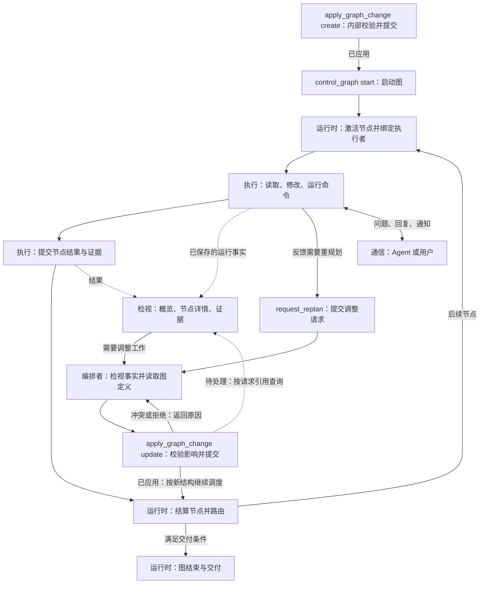

> 历史讨论稿：当前接口以原路径的落地契约为准。

# 四类工具定义与精简方案（讨论稿）

创建日期：2026-09-07。最近修订：2026-09-09（确认删除强制 Observation、决策工具及策略阈值控制链）。

状态：2026-09-09 已开始实施，跨层切换尚未完成，当前阶段不可作为发布版本。已确认项汇总于第 1、10 节；实施状态见第 13 节。目标工具目录不代表全部运行时入口已经可用，调用方、配置、测试与旧链路必须统一切换后才可交付。

## 1. 已确定的方向与本稿边界

- 工具分为执行、编排、检视、通信四类。这是工具职责分类，不是 L1–L5 的新分层，也不要求对应四个 Go 包。
- 执行用于完成当前节点任务；编排管理图定义、结构及生命周期；检视读取图、节点与 Agent 的运行事实；通信传递问题、回复和通知。
- `run_shell` 保留在执行类。
- 删除独立 `run_check`，测试命令统一通过 run_shell 执行。测了什么、测的是哪份代码和测试判定完全交由 Python 测试程序负责；AgentGo 不新增或迁移这类专门检查语义到 run_shell。所有 Agent 的每次 run_shell 调用均保存通用执行事实。
- 文件写入统一由 `apply_change` 承担，包括创建和修改；替代原 edit_file/write_file 的分立入口。文件变更与 `apply_graph_change` 的图结构变更分别处理。
- 删除 `submit_change_decision` 及其机械前置关卡。“先说明决策，再读取和修改”只作为提示词工作要求，不用新工具、自然文本解析器或结构化回执继续强制同一流程。
- 删除强制 Observation 机制，包括 record_observation_delta、单工具检查阶段、观察报告、回执等待及其派生行动约束。按策略轮数、累计新知识轮数、无进展次数、探索限额、默认预算耗尽等触发强制记录、停止、切换 Attempt 或恢复交接的规则一并删除，不仅删除 record 工具名称。
- 观察通过 inspect_board、inspect_node、read_evidence 读取执行事实；不要求模型填写报告来换取继续执行资格。运行时监测继续由现有 watchdog 负责，watchdog 代码不改，也不把被删除的阈值逻辑搬入 watchdog。
- `send_message` 仅传递信息：不唤醒或中断 Agent，不创建 Task/Activation，不改变任务、图结构或生命周期。消息类型、优先级和正文均不得赋予它控制作用。
- **不实现 `rw_stdin`**，本方案不增加交互式进程会话、后台进程句柄或对应读写工具。`run_shell` 返回前完成执行或明确报告失败、超时、取消；不以自行后台化的命令绕过生命周期管理。
- 前期讨论仅更新文档；2026-09-09 用户已授权按本文实施 L3–L5 关联变更并更新 AGENTS.md、测试 YAML 和必要的 Go/Python 测试代码。验收执行 Go 测试与构建，SWE 测试暂不执行；全部完成后提交并推送。不能通过改配置完成隐式切换。
- 编排类确定使用 `read_graph_definition`、`apply_graph_change`、`control_graph`、`request_replan`。初次建图与运行中改图共用一套工具，校验与提交在 `apply_graph_change` 内完成，不要求模型管理草案或单独调用校验、提交工具。
- 其余工具集合、命名、参数和合并方案仍待逐项讨论；已确认项不再标作“是否采用待定”。

每个工具统一用三项描述：**工具名称、权责范围、定义**。“三项描述”不改变“四类工具”的分类数量。

## 2. 分类规则

| 类别 | 核心问题 | 边界 |
|---|---|---|
| 执行 | 如何完成当前节点任务？ | 项目读取、搜索、变更、命令、测试和节点结果提交；不直接修改图 |
| 编排 | 工作如何组织和推进？ | 图定义读取、创建与动态变更、生命周期管理和重规划请求；校验提交由工具内部完成，不代替节点执行 |
| 检视 | 实际执行到了哪里，产生了什么？ | 读取运行状态、记录和证据；不借查询触发重试、提交或状态迁移 |
| 通信 | 需要向谁传达或询问什么？ | 消息和问答；投递不代表对方接受、开始执行或完成工作 |

`read_file` 读取项目文件，属于执行。读取保存的工具输出和任务产物证据属于检视。读取图定义属于编排，读取图运行状态属于检视。运行测试属于执行，查看已有测试记录属于检视。

分类按正式契约固定，不根据模型填写的用途临时改变。即使 `run_shell` 运行搜索命令，它仍属于执行工具。

## 3. 执行类：4 个候选入口

### 3.1 run_shell

- **工具名称**：`run_shell`，已确定保留，归入执行类。
- **权责范围**：在当前节点绑定的工作区中运行一次有界命令。覆盖目录查询、搜索、构建、测试及其他命令行操作。不承担消息传递、图管理或框架状态文件修改。
- **定义**：接收命令及工作目录，在当前节点的执行环境中运行，返回标准输出、标准错误及执行结果，包括退出码或失败、超时、取消状态。它是节点任务的通用命令行执行入口，运行测试也是其用途之一；命令成功不等于节点任务完成。具体输出字段与记录形式在接口契约讨论中确定。

**已确认的记录边界**：每次调用都记录实际命令、执行者及所属任务、执行状态、输出和退出结果；取消或执行结果不确定时如实记录。AgentGo 不识别某条命令是否是测试，不要求 check_id/exact_command，不生成测试专用 CheckRecord，也不绑定被测代码版本。Python 测试程序负责测试内容、被测代码及测试结果判定。通用执行环境、文件产物和任务身份记录仍服务于执行审计，不能据此重新引入测试专用门槛。

### 3.2 read_file

- **工具名称**：`read_file`，保留名称。
- **权责范围**：读取当前节点工作区中的项目文件，为调查和修改提供准确内容。不提供框架内部日志、跨节点私有工作区或任意 ContentRef 的文件路径旁路。
- **定义**：输入项目相对路径与可选行段；输出实际路径、行段、内容、内容版本及截断信息。读取不推进节点状态。后续编辑应能关联此次读取的内容版本，并检测跨 Agent 修改造成的过期。

### 3.3 apply_change

- **工具名称**：`apply_change`，采用能够覆盖文件创建与修改的名称。
- **权责范围**：对当前节点工作区提交明确的文件变更，登记产物与变更前后版本。不操作 Graph 或框架历史文件。
- **定义**：接收明确的文件变更并应用到当前节点工作区，覆盖创建、修改及文件写入需求，返回实际差异、执行结果和产物引用。具体创建、修改、删除等操作的 schema 与并发一致性由实施契约细化，不再保留“只能编辑已有文件”的能力限制。文件变更不经过 apply_graph_change。

旧 edit_file/write_file 的文件访问、并发控制和产物记录需迁入统一实现；新名称不能只是旧入口的转发别名。先说明决策是提示词要求，不恢复 submit_change_decision 的执行门槛。

### 3.4 submit_task_result

- **工具名称**：`submit_task_result`，保留名称。
- **权责范围**：提交调用者当前节点的执行结论、产物和证据，不替其他节点提交结果，不直接启动下游。
- **定义**：输入当前角色允许的终态声明、结构化结果、摘要和证据引用；blocked 必须包含原因。运行时验证角色契约、证据和持久化后进入唯一终态收口。返回提交回执；后续图路由由运行时完成。Verifier 的 verdict 属于其节点执行结果，不能用普通测试退出码替代。

## 4. 编排类：4 个已确认的设计入口

本节确认工具职责与交互方式，尚未实现。模型表达要创建的图或要应用的变更；运行时执行校验、准入和事务提交。草案可以是内部临时对象，不要求模型创建、维护或提交草案。

### 4.1 read_graph_definition

- **工具名称**：`read_graph_definition`。
- **权责范围**：读取正式图的节点规格、边、路由、验收规则及定义版本，为初步了解和动态变更提供结构依据。节点执行进度和结果通过检视类获取。
- **定义**：输入明确的图引用，可指定历史 revision 或读取当前版本，可按节点或结构片段读取；返回实际 revision、定义内容和分页信息。同次分页必须绑定同一版本。可附 Agent 模板/能力目录引用，不将模板声明当作活跃 Agent 状态。对象不存在时返回未找到，读取不创建对象、不改变图状态。

### 4.2 apply_graph_change

- **工具名称**：`apply_graph_change`。
- **权责范围**：创建正式图，或修改已有图（包括正在运行的图）的定义与结构。内部完成结构、权限、能力、输入输出、执行影响和所需准入校验，再提交变更。创建成功不自动启动图；运行图变更成功后由运行时按新结构继续调度，不要求再次启动整图。不替节点执行任务，不改写已经发生的执行事实。
- **定义**：使用显式 `operation=create/update` 区分两种请求。创建输入完整图定义；修改输入 `graph_id`、`expected_revision`、结构化 `changes`，以及对受影响在途节点的明确处置。运行时绑定调用身份，并以稳定请求身份关联校验、准入和提交。成功返回图引用、新 revision、实际差异及提交回执；失败返回原因、错误位置或冲突事实，正式图不留下部分变更。模型无需另交校验报告或再调用提交工具。

**动态变更与事务边界：**

- 未开始的节点可以在校验通过后调整定义、依赖或删除；尚未开始执行但已经冻结的 Activation 也必须纳入影响检查，不能只看 pending 状态就原地覆盖。
- 正在执行的节点不得被悄悄换目标。变更必须明确让本次执行继续、请求取消并等待结算，或在本次结束后安排新的执行；具体可支持的处置由版本化契约约束。已完成节点保留结果和证据，需要返工时建立新的执行实例。
- 变更准备期间，不受影响的工作可以继续。图 revision 与节点运行状态可能分别变化，因此提交时须在一致的提交边界重新检查基础版本和受影响执行状态；仅检查图 revision 不足以防止并发冲突。
- 校验、必要的 Proposal Acceptance 和提交属于同一次请求的内部流程；机械通过不等于全部准入通过。不得因合并工具而取消必要的校验或让模型机械补调另一入口。
- 若需要等待准入或在途任务结算，返回“待处理”及请求引用，不能声称已应用。后台处理在条件满足后重新校验再提交；请求状态通过检视类查询，不额外增加校验、提交或等待工具。
- 回执区分“已应用”“已拒绝/冲突”“待处理”；执行中断导致结果无法确认时如实报告不确定，并允许按请求身份查询持久化状态。同一请求重试不重复创建图或重复应用变更；修改内容后形成新的请求。
- 校验失败不改变正式图；取消在途任务等控制副作用无法用结构回滚抹除，须单独记录其接受与结算事实。不能把图定义事务原子性表述为所有外部副作用均可回滚。
- 终态图不能通过 update 隐式复活。允许的运行图变更范围、历史版本拒绝/恢复规则及具体字段 schema 在实施设计中确定。

**同一入口的两种用法（语义示意，不是最终 JSON schema）：**

```text
apply_graph_change(operation=create, definition=完整图定义)
apply_graph_change(operation=update, graph_id=目标图,
                   expected_revision=所依据的版本,
                   changes=结构变更及在途节点处置)
```

### 4.3 control_graph

- **工具名称**：`control_graph`。
- **权责范围**：控制已提交图的生命周期，不修改图定义，也不允许直接改写节点的业务成功状态。
- **定义**：首版动作仅为 `start` 和 `cancel`，使用显式图引用、预期状态及请求身份。运行时检查控制权限及状态迁移，返回请求回执与实际当前状态。重复请求不得重复启动；取消请求被接受不意味着在途副作用已经结算，进展通过检视类查询。暂停、恢复、单节点重启和跳过节点不纳入首版。

图取消所需的运行时事务在实施阶段对账；本节确认工具职责，不宣称当前代码已支持新入口。启动仍遵守历史会话不自动续跑。

### 4.4 request_replan

- **工具名称**：`request_replan`，保留名称。
- **权责范围**：当前节点向具备编排权限的主体提交调整图的请求，不直接修改图，也不通过普通消息获得编排权限。
- **定义**：输入原因、相关运行事实或证据引用、建议调整范围；运行时绑定来源节点和任务，返回重规划请求回执。具备编排权限的主体通过检视和 read_graph_definition 获取当前情况，再决定是否调用 apply_graph_change。重规划请求被接受不等于图已经改变；决定无需改变时也须有明确的请求处理结论，其收口映射在实施前对账。Graph 终态后的请求只按明确策略记录或拒绝，不隐式复活图。

## 5. 检视类：3 个候选入口

### 5.1 inspect_board

- **工具名称**：`inspect_board`，新候选名称；承担“阅读公告板”的运行概览需求。
- **权责范围**：查询授权 Session/Run/Graph 范围内的节点、Agent、任务状态和资源使用概览；不创建任务，不唤醒 Agent。
- **定义**：输入运行范围及节点状态或 Agent 过滤条件；返回带观测时间和一致性边界的有界概览，包括活动任务、执行者、上下游结算情况、终态和详情引用。支持按编排请求引用查询变更或控制请求的处理状态、冲突原因及生效版本；新图尚未创建时也可按授权请求身份查询，不要求已经有 graph_id。展示活跃 Agent 与模板目录时明确区分。不得默认扫描全部历史 Session。

### 5.2 inspect_node

- **工具名称**：`inspect_node`，新候选名称。
- **权责范围**：检查自己或其他授权节点的执行详情、结果与因果关系，不把“查询”变为等待任务完成的隐式控制操作。
- **定义**：输入图、节点及必要的 Activation/Task/Attempt 选择条件；可选择状态、结果或执行记录视图，返回版本化状态、工具调用回执、失败事实、消息关联及证据引用。存在多次 Activation 时返回索引或要求明确选择，不混合各代结果。无结果、尚未运行和已经失败是不同状态。

### 5.3 read_evidence

- **工具名称**：`read_evidence`，新候选名称。
- **权责范围**：读取已经保存的命令输出、文件产物和其他执行证据，不启动命令，不生成测试判定，不修改证据。
- **定义**：输入运行时返回的真实类型化引用及可选分页条件；返回来源调用、Task/Attempt/Activation、适用的产物身份、摘要及内容。不同引用类型分别验证和解析，不当作可互换字符串。Python 测试输出可作为普通命令输出读取，其测试语义由测试程序负责。动态内容不可用时明确报告，不拿当前文件冒充历史产物。

日志分页位置使用独立查询契约，不复用 L2 的 `eventCursor`。流式事件游标 / SSE events cursor 仍专用于 L2 模型输出订阅；检视工具不替代 UI 的实时订阅接口。

## 6. 通信类：2 个候选入口

### 6.1 send_message

- **工具名称**：`send_message`，已确认保留，仅传递信息。
- **权责范围**：在授权协作范围内传递问题、回复和通知。除消息自身的投递与记录外，不改变任务、图、权限、验收状态或执行结果；不唤醒或中断 Agent，不触发新任务或 Activation。
- **定义**：输入明确接收者、消息类型、正文、可选证据引用和 `reply_to`；发送者及所属任务身份由运行时绑定。返回消息身份和投递回执。已持久化、已投递、已读、已回复分别表达；消息成功不表示对方接受工作。正式任务委派通过编排完成，不靠消息正文建立隐藏任务依赖。

**已确认的行为边界**：收件 Agent 仅在正常执行流程的消息接收点获得信息；空闲时不因消息开始执行，正在执行时不被消息强制打断。图已终态时消息也不使其恢复或产生图外工作。消息中的问题或建议可以供接收者在正常执行时判断，但不能作为自动派发任务、修改图或确认结果的指令；实际动作仍通过相应执行或编排契约完成。

info/question/reply、接收者数量、回复关联及收件形式属于具体接口设计，本文不把候选建议当作已确认限制。无论这些字段最终如何定义，都不允许通过 steer、优先级或其他标记重新引入消息唤醒和状态控制。当前代码中的相关唤醒行为需在后续实施中移除或解除关联；本次仅确认设计，不修改运行时。

### 6.2 request_user_input

- **工具名称**：`request_user_input`，保留名称。
- **权责范围**：向用户获取当前任务缺失的信息或选择，不代替 Shell 授权、图审批或终态提交。
- **定义**：输入明确问题及可选受约束选项；返回关联请求的用户回答或明确取消状态。用户未回答不等于批准。等待期间的取消、deadline 和恢复沿用明确的运行策略，不由自然语言消息绕过。

## 7. 统一审计与多代理边界

四类共用调用回执原则，不共用一个可以任意执行所有动作的万能工具：

- 运行时绑定 Session、Run、Graph、Node、Activation、Task、Attempt、Invocation、ToolCall 等适用身份；不适用字段保持缺席，不由模型伪造关联。
- 请求包含明确的目标对象和版本，回执包含实际结果、失败类别、证据引用和时序。模型给出的“目的”只作说明，不作行为权威。
- 执行事实、模型判断、消息陈述、正式结算分别标识。Shell exit=0、节点 completed、验收 pass、Delivery committed 不能互相替代。
- 跨节点读取需要保持来源身份；共享工作区需要保持实际版本与并发控制。容器负责环境隔离，不能代替候选版本和因果记录。
- 大输出有界返回并给出完整内容引用；分页明确，不静默截断后假装完整。修改与取消的结果不确定时如实记录，不自动重复副作用。
- 类别不直接授予权限。Worker、Scheduler、Verifier 按角色持有子集；不能把本目录全部工具一次性暴露给所有 Agent。
- 自动上下文注入、订阅、状态结算仍可由运行时完成，不为凑全工具目录要求模型调用一次。

目标目录共 **13 个入口：执行 4、编排 4、检视 3、通信 2**。其中编排四工具方案及 send_message 仅传递信息的边界已确认，其余具体候选仍按各节说明讨论。这是跨角色工具目录，不是每次请求的工具列表，也不是固定数量验收指标。当前尚需保留的框架入口不包含在目标数量中，不得因此漏算或宣称已经删除。

## 8. 现有工具的对应与待决事项

本表区分已确认的目标处置与仍需补齐的迁移工作，不是已完成代码删除的证明。

| 现有入口 | 目标类别与方向 | 实施前必须解决 |
|---|---|---|
| read_file、edit_file、write_file | 执行：保留 read_file，写入统一为 apply_change | 迁入文件访问、并发校验、产物及 Effect 记录；旧写入入口退役 |
| list_dir、grep_search、glob_search、probe_directory | 执行：候选由 run_shell 承担 | 当前 Explorer 的只读能力与证据范围、跨平台命令、输出预算；不能仅删配置 |
| run_shell、run_check | 执行：保留 run_shell，删除 run_check 及 AgentGo 测试专用语义 | 清理 Graph/Lease 的旧 raw Shell 禁令和 CheckContract/CheckRecord 依赖；所有调用保留通用执行事实，测试语义由 Python 测试程序负责 |
| web_search、web_fetch | 执行：不列入最小 SWE 候选集，按业务保留可选能力 | 搜索服务能力不能假定等价于普通 Shell 下载；不能据此删除通用产品需求 |
| submit_task_result | 执行：保留 | finalizing 优先级、证据验证、唯一终态不变 |
| record_observation_delta、submit_change_decision | 已确定删除工具及强制记录/决策机制 | 同步删除 L3 单工具阶段、L4 阈值触发、回执等待、派生行动约束和测试程序强制检查；不迁入 L2、watchdog 或另一工具 |
| submit_recovery_decision | 编排：恢复裁决，向四工具方案的收口映射待对账 | 现有恢复控制器结算与变更提交不是单纯别名；13 个入口尚不能宣称无损替代这一协议 |
| request_replan | 编排：保留明确的请求入口 | 请求与变更生效分离 |
| publish_task | 编排：图内工作统一经图定义安排 | Graph 节点当前已禁止脱图任务；非图及历史业务入口不在本轮清理范围 |
| submit_graph、patch_graph、create_graph_draft、configure_simple_graph_draft、patch_graph_draft、propose_graph_change | 编排：apply_graph_change 的 create/update 请求 | 取消模型管理草案的必经流程；内部保留必要的暂存、验证和事务机制，区分初建与运行图变更 |
| read_graph、read_graph_draft、read_graph_change | 编排：read_graph_definition；请求与运行状态转检视 | 内部草案不再作为模型必须管理的对象；定义、请求状态和运行事实分别有明确权威 |
| validate_graph_draft、validate_current_graph_draft、validate_graph_change | 编排：apply_graph_change 内部校验 | 不再要求独立模型调用；绑定请求、版本及执行状态，保留必要的 Proposal Acceptance |
| commit_graph_draft、commit_current_graph_draft、commit_graph_change | 编排：apply_graph_change 内部提交 | 与校验合为一次请求，保留事务、准入、幂等与未知结果语义，不增加旧工具转发 wrapper |
| start_graph、start_current_graph、cancel_task | 编排：control_graph 及待决节点控制 | 单节点取消不等同于整图取消，不自动扩大新入口能力 |
| submit_graph_change_decision | 编排：协调请求的无变更收口，归并方式待决 | 必须保留 no_change 的持久化结论，不用自然文本退出替代 |
| get_task_result、read_content_ref | 检视：inspect_node、read_evidence | 引用类型、完整内容与访问范围；当前 Scheduler 专用查询不能直接视为全角色可用 |
| list_agent_templates、provision_agent_team | 编排：资源目录与执行团队配置，最小集外能力 | 动态 Team/Spawn 若继续支持，需要另列扩展工具；不能把模板查询当作运行检视，也不能假定创建图就完成资源配置 |
| report_progress、report_done | 运行事实检视投影及最终交付，入口映射待决 | 保留 Run/Graph final-report 与节点结果的不同作用域；不能直接给 submit_task_result 加别名 |
| send_message、request_user_input | 通信：保留；send_message 仅传递信息 | send_message 的唤醒与任务触发关联须移除；投递、回复链与用户问答契约分别对账，不把旧控制行为带入新定义 |

本稿尚不是可直接切换的完整实施协议。Observation、run_check 和 submit_change_decision 的删除方向已确认，剩余工作是彻底清理依赖；恢复裁决、无变更协调收口、final-report 和动态团队仍需明确迁移映射，不能借这些缺口保留已确定删除的机制。

## 9. 典型调用流程



图中“需要调整工作”必须经过有权限的编排者，不表示任意检视者都能修改图。动态变更不重新走整图启动，也不重复结算已经完成的节点；箭头指向运行时按新定义继续调度。普通成功流无需额外发消息唤醒下游，图路由负责依赖推进。冲突反馈供重新判断，不代表无条件自动重试。

## 10. 已确认删除范围与实施准备

### 10.1 已结束的行为讨论

run_check 删除，测试语义交给 Python 测试程序；run_shell 每次保留执行事实。文件写入统一到 apply_change。submit_change_decision 与强制 Observation 一并退役，不再要求模型填写记录才能继续工作。编排四工具和消息仅传递信息已确认。watchdog 不改。

### 10.2 强制 Observation 与策略阈值的删除清单

| 必须删除的内容 | 主要调查入口 | 完成判据 |
|---|---|---|
| record_observation_delta 注册、schema、自动补充、独立模型调用及专用探针 | internal/tools/observation.go、internal/observationcontract、internal/config/framework_tools.go、Observation probe 装配 | 新任务无需声明或探测该能力，不产生该调用；不能只把注册隐藏 |
| Observation-only ToolRouter、强制提示、pending marker、回执等待及 mutation commitment | internal/agent/scheduler_tool_phase.go、llm_executor.go、agent.go | 合法业务读取/修改不因缺 Observation 被拒绝；不再把回执作为下一步许可 |
| 周期决策/知识检查、无进展计数、探索轮数、决策停滞阈值及默认预算触发的停止/恢复 | internal/agent/loop_progress.go、internal/policycatalog、相关 Run/Progress 默认策略 | 删除这些默认规则及其控制分支，不改成更大数值、默认关闭开关或另一个版本的同类约束 |
| 为历史裁剪、Attempt 切换、预算耗尽或恢复交接而强制补交观察记录 | internal/agent/agent.go 与上下文/任务记忆接缝 | 这些路径不等待模型自评报告；裁剪仍保留必要的工具调用/结果关系和执行事实 |
| 基于缺报告、观察停滞或阶段外 record 调用生成的拒绝、重试、blocked 与恢复请求 | L3 校验、L4 错误处理、L5 恢复接入 | 不再因为被删除的规则改变任务状态；实际执行错误与主动重规划仍按对应契约处理 |
| SWE Test Runner 的 Observation 活探针前置检查、检查点次数门槛和 record 阶段断言 | scripts/swe_test_runner/runner.py 的 preflight_observation_probe、控制调用与架构检查；对应 fixture/测试 | 新运行没有 record 调用也能通过；不再因已退役的检查点规则判为架构失败 |
| 活动提示词、配置、策略说明与测试中对上述机制的承诺 | prompts、config fixtures、AGENTS.md、活动设计与测试文档 | 生产调用方和测试不再要求旧路径；旧磁盘日志按历史事实保留，不用旧断言评价新运行 |

这里的“阈值删除”包括前文列出的周期轮数、新知识累计、无进展/探索限额、默认预算耗尽，以及由此产生的强制报告、停止和恢复交接。统计可以用于展示，不能换名后继续作为上述控制门槛。默认阶段时间预留与自动 handoff 若承担同样的强制推进作用，也须纳入调查和删除，不只清理 record 的直接调用点。

不把“默认进展策略阈值”与用户明确设置的执行限制、HTTP/进程超时、真实 provider 配额错误或 watchdog 现有保护混为一谈。后几项的具体处理范围需在实施清单中逐项说明，不能据本次决定顺手删除整个取消与故障处理系统，也不能以其名义恢复已退役的默认进展关卡。watchdog 源码保持不变。

原报告曾服务于任务记忆、Context 投影与恢复。清理依赖时以原始执行事实和检视接口承接必要数据访问，不创建新的强制模型摘要工具，也不声称现有 watchdog 已经具有相同的模型语义判断能力。

### 10.3 剩余实施准备

1. 完成参数、返回、分页、权限、事务及错误 schema；这些属于工程设计，不重复询问已确认的行为方向。
2. 列出 CheckContract、CheckRecord、Graph fulfillment/验收与 Python 测试程序的实际解耦路径，确保不把测试语义偷偷迁入 run_shell。
3. 对照本节列出文件级删除、迁移、重写和调用方切换清单；对账恢复裁决、无变更收口、final-report 和动态团队的剩余职责。
4. 明确新版本与旧会话/策略数据的恢复或拒绝边界；当前冻结规范描述旧实现，后续实施须同步更新，不能以冻结为理由保留已决定删除的目标行为。
5. 验证合法调查可以连续进行、不再生成强制报告或因轮数转入恢复；逐次 Shell 事实完整，四类工具协作和图动态变更可执行；确认 watchdog 源码未变。同步执行 Go 回归、Python 测试和真实二进制产物检查。

本次文档不修改现有实现状态，不把旧测试结果当作目标工具集的验证证据，不创建旧接口转发 wrapper。

## 11. 当前实现核对入口

- [当前工具与 profile](../tool-profiles.md)：现行配置用法。
- [工具注册清单](../../internal/tools/known_tools.go)：现有工具名。
- [框架自动补充工具](../../internal/config/framework_tools.go)：配置工具不等于实际注册全集。
- [Execution Lease](../../internal/agent/execution_lease.go)：角色授权、只读闭集与 raw Shell 限制。
- [阶段工具投影](../../internal/agent/scheduler_tool_phase.go)：Observation、Recovery 与 Scheduler 的当前工具面。
- [Shell](../../internal/tools/shell.go)、[Check](../../internal/tools/check.go)、[文件变更](../../internal/tools/local_write.go)：当前执行契约。
- [消息与任务发布](../../internal/tools/meta.go)、[结果查询](../../internal/tools/scheduler.go)：现有通信和查询行为。
- [Scheduler 上下文入口](../../internal/scheduler/executor.go)：公告板主要通过上下文注入，不是现有 read_board 工具。
- [冻结边界](contract-freeze-2026-08-30.md)、[五层规范](five-layer-engineering-architecture.md)：当前权威，不被讨论稿覆盖。
