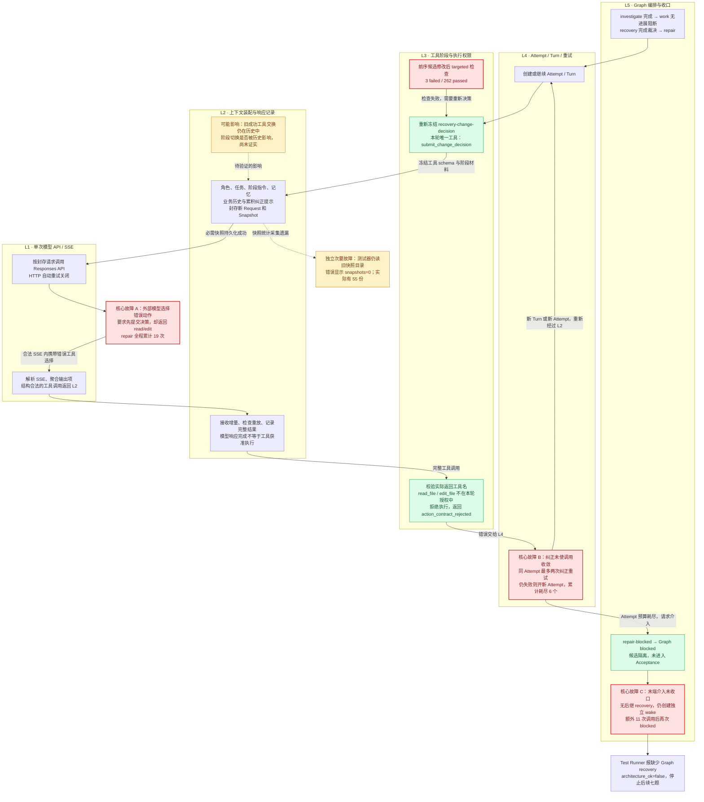

# automatic-options 错误调用：L5 → L1 分层调查

本调查与 [首题审计](2026-09-07-0445-l1-l2-flask-audit.md) 指向同一个 Run：`run-swe-automatic-options-4e2d19a0-a1af-4c14-99de-910a1858d046`，代码为 `4626bd3`。本次只补充源码、历史和 Trace 对账，不修改执行逻辑，不重新调用模型。

核心结论：失败是“候选修改不正确 → 模型未遵守新的 Recovery 决策阶段 → L4 重试持续消耗预算 → Graph 末端又产生独立 wake”的级联。L1 SSE 与 L3 拦截在本次证据中正常；L2 已交付阶段约束，但历史与新阶段的组合是否加剧错误选择，仍需因果对照。

## 单图：请求向下，结果与错误向上

红色表示已经发生的失败或放大失败的环节，不等于该节点所属包已被证明存在编码缺陷。黄色表示待验证的行为影响或次要观测问题；绿色表示本次有效的保护边界。图以 repair 检查失败后的调用为主线，19 次拒绝包含检查之前的两次拒绝。

图中未展开的单次异常：repair Attempt 2 第 3 Turn 收到 response.incomplete/max_output_tokens，L1 返回 output_truncated，L4 直接进入新 Attempt。这是另一次失败，不包含在 19 次阶段拒绝中，也没有分发工具。

## 按 L5 → L1 的职责与证据

| 层级 | 本次实际行为 | 证据与判断 |
|---|---|---|
| L5 | work 无进展后创建 recovery，再创建 repair；repair blocked 走 repair-blocked end | 实际 Graph 边是 repair completed → acceptance-repair，failed → repair-failed，blocked → repair-blocked。没有第二个 repair recovery controller 是当前图的有界终止结构，不能简单补无限恢复节点。 |
| L5 控制桥 | 找不到以 repair TaskID 为源的 recovery controller，调用 EnsureTask 生成独立 wake | `internal/bootstrap/loop_intervention.go:291` 至 `:308`。没有在此路径检查 Graph 已走 terminal end；wake 在 Graph blocked 后仍调用 11 次，反复读取后自身阻断。 |
| L4 | 对 action_contract_rejected 先两次 Attempt 内纠正重试，随后允许 RetryRollback；截断直接进入新 Attempt | `internal/loopcontrol/recovery.go:39`、`internal/agent/agent.go:1511`、`handleFailure:2017`。循环有 6 Attempt 上限，并非无限，但相同阶段持续犯错时仍消耗大量调用。 |
| L3 | 候选检查失败后撤回 edit/run_check 阶段，要求新的 submit_change_decision | `internal/agent/recovery_evidence_gate.go:121` 使用 latestRecoveryCheckState 和检查之后的 latestRecoveryChangeDecision；`scheduler_tool_phase.go:44` 生成明确阶段指令。 |
| L3 返回门 | validateToolCallBatch / validateRecoveryActionCall 在工具 dispatch 前拒绝阶段外调用 | `internal/agent/llm_executor.go:581`。实际 19 个拒绝 Turn 都没有工具执行；不能通过放宽权限解决模型不遵守当前阶段的问题。 |
| L2 | 将阶段材料、记忆、业务历史和纠正提示编译为新请求，先保存快照，再调用 L1；返回后先记录结果再交 L3 | `internal/contextruntime/runtime.go:95`、`:196`、`:222`。受查决策轮的阶段片段均 inline，唯一 tool_definition 是 submit_change_decision，未见裁剪导致约束缺失。 |
| L2 历史 | Recovery 使用 business 模式，排除 Observation 控制交换，保留其它业务交换；Phase 在 History 之前装配 | `internal/agent/llm_executor.go:396`、`internal/contextruntime/history_modes.go:140`、`runtime.go:272`、`:290`。旧 read/edit 的成功交换仍可能影响下一动作选择，但这只是可检验假设，不能从模型错误直接推出 L2 是根因。 |
| L1 | 显式 Responses SSE；MaxRetries(0)；返回规范化的完整结果或 typed failure | `internal/llm/client.go:104`、`:122`。L1 不根据业务阶段决定工具是否执行；有效 JSON/SSE 中的越阶段工具名由 L3 判定。54 次业务调用均有 SSE 事件事实。 |

## L4 放大机制的逐 Attempt 对账

| repair Attempt | 模型调用 | L3 接受 | 阶段拒绝 | 输出截断 |
|---|---:|---:|---:|---:|
| 1 | 11 | 6 | 5 | 0 |
| 2 | 3 | 0 | 2 | 1 |
| 3 | 3 | 0 | 3 | 0 |
| 4 | 3 | 0 | 3 | 0 |
| 5 | 3 | 0 | 3 | 0 |
| 6 | 3 | 0 | 3 | 0 |
| 合计 | 26 | 6 | 19 | 1 |

Attempt 1 的六次接受依次为 read_file、submit_change_decision(need_context)、read_file、submit_change_decision(edit)、edit_file、run_check。两次早期拒绝后曾成功纠正；因此不能说模型从头到尾完全不会使用决策工具。主要持续失败发生在候选检查失败之后。

原始历史保存了 **14 条** `[same-snapshot-retry 1/2或2/2]` 系统提示，内容为拒绝原因、保持当前 Attempt、遵守本轮 ToolRouter/schema。反馈确实存在；没有实现的是有效收敛。两次提示额度在新的 Attempt 重新获得。

`retry_same_snapshot` 的命名不能按字面理解：L4 continue 再次调用 Execute，L2 重新 Compile，追加提示已经改变上下文。实际 Attempt 1 的 Turn 9/10/11 有三个不同的 SnapshotID 和 encoded_request_digest。这里复用的是 Attempt/阶段及历史基础，不是同一个封存 Request；它也不是 L1 SDK 的隐藏 HTTP 重试。

## L5 终态和测试判定需要一并澄清

04:43:47 repair 因 Attempt 耗尽 blocked；04:43:48 Graph 进入 blocked；04:44:31 独立 wake 才最终 blocked。原始 repair-blocked end 成功执行，Acceptance 节点未执行。

当前 `missing_loop_recovery_sources` 只以 Graph recovery controller 是否引用该 source 为依据，没有覆盖“末端 repair 已通过合法 blocked end 收口”的情况。因此应同时校正 terminal intervention 的吸收规则和测试判据。存在独立 wake 并不能证明已完成有效 recovery；没有第二个 controller 也不能单独证明应该再创建一层 recovery。本次真实问题是额外 wake 已经空转并再次耗尽进展预算。

## 对重构归因的边界

- **已确认直接遗漏**：Test Runner 继续读取旧 context-snapshots 目录，导致指标为零；不在模型请求/执行控制链中，不是 19 次错误调用的原因。
- **已有源码机制、本次运行暴露问题**：两次 Attempt 内重试加新 Attempt、检查失败回 decision、无 controller 时创建 wake，均可在父提交找到。Recovery gate 的本次变化主要是 HistoryEntry 类型归属迁移。
- **未完成因果验证**：L2 新装配顺序、角色分离和记忆投影是否降低阶段遵循率。需要使用同模型、等价冻结材料开展受控阶段切换验证；不能靠再次跑一轮得到随机成功就宣告根因已解决。

下一步应分别建立“检查失败 → 新决策 → 再编辑”场景和“最终 repair blocked → 只做终态结算”场景的确定性回归，再评估实际模型的阶段遵循率。不得通过增大 Attempt 数、放开阶段外工具、跳过架构检查或把候选直接合并来消除表面报错。
